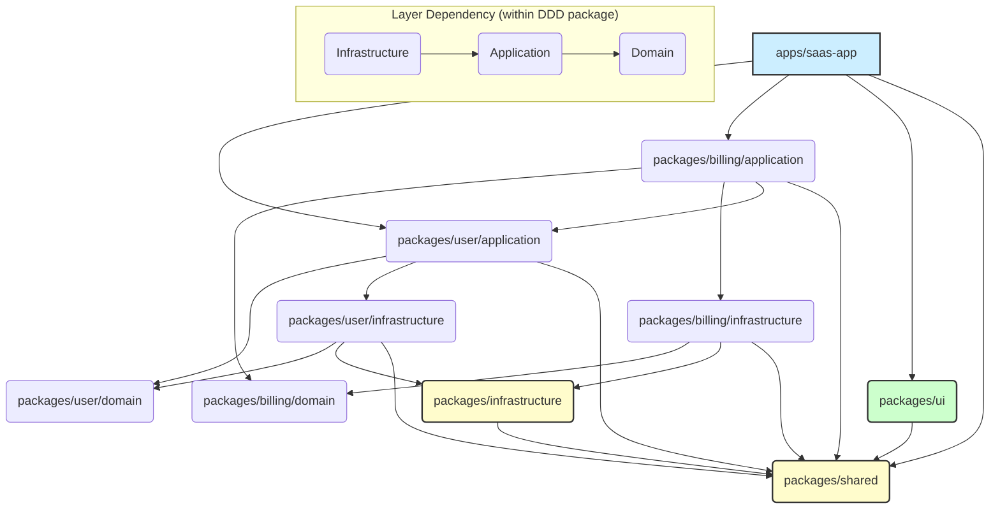
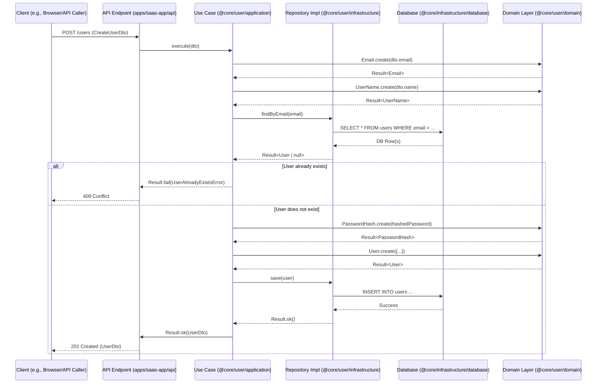

# Core SaaS Framework 設計・移行・実装ガイド

## 📜 このドキュメントについて

このドキュメントは、Core SaaS Framework の設計思想、現状からの移行計画、基本的な実装ガイドライン、および将来的な拡張計画を統合したものです。元々は複数の文書に分かれていた内容を、開発時の参照性を高めるために一つにまとめました。

**構成:**

1.  **[設計書：Core SaaS Framework 理想構成の設計](#1-設計書core-saas-framework-理想構成の設計)**: フレームワークが目指す理想的なアーキテクチャ、ディレクトリ構造、主要技術スタック、設計原則を定義します。
2.  **[移行計画書：現状からの段階的移行手順](#2-移行計画書現状からの段階的移行手順)**: 既存のアプリケーションから理想構成へ移行するための具体的なステップ、現状分析、リスク管理について記述します。
3.  **[ベースドメイン実装指示書](#3-ベースドメイン実装指示書)**: フレームワーク全体で共通して利用される基底クラス (Entity, ValueObject, Repository など)、共通のエラー型、Result型、基本的な設計パターン、命名規則、およびテスト戦略の基礎について解説します。ドメイン固有の実装を行う上での共通基盤となります。
4.  **[Userドメイン実装指示書](#4-userドメイン実装指示書)**: 主要ドメインの一つであるユーザー管理機能を例に、ドメインの責務、パッケージ構造、主要コンポーネントの実装、テスト戦略を具体的に示します。他のドメインを実装する際の具体的な参照モデルとなります。
5.  **[将来展開計画書：CLI化・ライブラリ化戦略](#5-将来展開計画書cli化ライブラリ化戦略)**: フレームワークの長期的な展望として、CLIツールの開発や機能のライブラリ化によるエコシステム形成計画について記述します。
6.  **[用語集](#用語集)**: このドキュメント内で使用される主要な技術用語や設計パターンについて解説します。

---

# 1. 設計書：Core SaaS Framework 理想構成の設計

## 🎯 目的

**(このセクションの目的)**: このセクションでは、Core SaaS Framework が目指すアプリケーションとパッケージの理想的な構成、採用する主要技術、および設計上の基本原則を定義します。フレームワーク全体の設計思想の基盤となります。

この設計書は、単一のSaaSアプリケーションから、**再利用可能なSaaS製造マシン**への進化を実現するための理想的な構造を定義します。この設計により、複数のSaaSプロジェクトで再利用可能なコンポーネントを効率的に作成・管理できるようになります。

## 📋 前提条件

- **ドメイン駆動設計（DDD）と Clean Architecture の採用**
  - ドメイン中心の設計を基本とするが、他の設計アプローチに基づくパッケージも共存可能
  - レイヤー間の明確な責任分離
  - 依存関係の方向の制御（内側に依存）
- **依存性注入 (DI) コンテナの活用** (例: `tsyringe`)
  - クラス間の依存関係を疎結合にし、テスト容易性を向上

- **TypeScript による型安全性の確保**
  - 厳格な型定義によるバグの防止
  - 高い保守性と拡張性の提供

- **Next.js によるフロントエンド**
  - App Router の活用
  - Server Components と Client Components の適切な使い分け

- **ORM**: Drizzle ORM
- **データベース**: PostgreSQL
- **認証**: Auth.js (NextAuth.js v5)
- **テスト**: Vitest (Unit/Integration), Playwright (E2E)

## 🏗️ 全体アーキテクチャ

**モノレポアプローチ**（**Turborepo** による実装）を採用します。


*(上記はアーキテクチャの依存関係を示す図の例です。実際の開発では Mermaid などのツールで図を生成・管理することを推奨します)*

### モノレポのメリット

- **コード共有の容易さ**：共通コンポーネントやロジックを複数アプリケーションで再利用
- **一貫性の維持**：設計原則、コーディング規約、テスト戦略の統一
- **独立したデプロイ**：個別のパッケージやアプリケーションを独立してデプロイ可能
- **将来のマイクロサービス化への準備**：モジュール間の境界と依存関係の明確化

## 📂 ディレクトリ構造 (理想形)

```
/
├── apps/                    # アプリケーション群
│   ├── saas-app/            # メインSaaSアプリケーション (例: Next.js)
│   │   ├── app/             # Next.js App Router
│   │   ├── public/          # 静的ファイル
│   │   ├── tests/           # アプリケーション固有テスト
│   │   │   └── e2e/         # E2Eテスト (Playwright)
│   │   │       └── __tests__/
│   │   │           └── user-login.e2e.test.ts
│   │   └── package.json     # アプリ固有の依存関係
│   └── admin/               # 管理者向けアプリケーション（将来的に）
│
├── packages/                # 再利用可能なパッケージ群 (ドメイン、共通ライブラリ、ツール等)
│   ├── shared/              # 共通ユーティリティ・ベース定義
│   │   ├── base/            # 基本クラス・インターフェース (entity.base.ts, repository.base.interface.ts)
│   │   ├── errors/          # エラー定義 (app.error.ts)
│   │   ├── result/          # Result型 (result.ts)
│   │   ├── types/           # 共通型定義 (common.types.ts)
│   │   ├── utils/           # ユーティリティ関数 (id.utils.ts)
│   │   └── value-objects/   # 共通値オブジェクト (id.vo.ts)
│   │
│   ├── infrastructure/      # インフラストラクチャコンポーネント
│   │   ├── database/        # DBクライアント (Drizzle), スキーマ
│   │   ├── auth/            # 認証サービス (Supabase連携)
│   │   └── logger/          # ロギング
│   │
│   ├── ui/                  # UI コンポーネント
│   │   ├── components/      # 再利用可能なUIコンポーネント (button.tsx)
│   │   ├── hooks/           # カスタムフック (use-toast.ts)
│   │   └── providers/       # コンテキストプロバイダー (theme-provider.tsx)
│   │
│   ├── user/                # ユーザードメインパッケージ (DDD)
│   │   ├── domain/          # ドメイン層 (詳細は下記)
│   │   ├── application/     # アプリケーション層 (詳細は下記)
│   │   └── infrastructure/  # インフラストラクチャ層 (詳細は下記)
│   │
│   ├── [feature-name]/      # その他の機能パッケージ (例: billing, mcp-client, realtime-service)
│   │   └── ...              # パッケージごとの構造 (DDDとは限らない)
│
├── tsconfig.base.json       # 共通TypeScript設定
└── turbo.json               # Turborepo設定
```

## 📦 ドメインパッケージの内部構造 (例: user)

DDDに基づくドメインパッケージは以下の構造を持ちます：

```
packages/user/
├── domain/                  # ドメイン層
│   ├── entities/            # エンティティ
│   │   ├── __tests__/       # テスト (Vitest)
│   │   │   └── user.entity.unit.test.ts
│   │   └── user.entity.ts
│   │
│   ├── value-objects/       # 値オブジェクト
│   │   ├── __tests__/       # テスト (Vitest)
│   │   │   └── email.vo.unit.test.ts
│   │   ├── user-id.vo.ts
│   │   └── email.vo.ts
│   │
│   ├── enums/               # 列挙型
│   │   ├── __tests__/       # テスト (Vitest)
│   │   │   └── user-status.enum.unit.test.ts
│   │   └── user-status.enum.ts
│   │
│   ├── repositories/        # リポジトリインターフェース
│   │   └── user.repository.interface.ts
│   │
│   └── services/            # ドメインサービス (Userドメイン固有のものがあれば)
│       # 例: user-profile.service.ts
│
├── application/             # アプリケーション層
│   ├── usecases/            # ユースケース
│   │   ├── __tests__/       # テスト (Vitest)
│   │   │   ├── create-user.usecase.unit.test.ts
│   │   │   └── create-user.usecase.integration.test.ts
│   │   ├── create-user.usecase.ts
│   │   └── find-user-by-id.usecase.ts
│   │
│   └── dtos/                # データ転送オブジェクト
│       ├── user.dto.ts
│
├── infrastructure/          # インフラストラクチャ層
│   ├── repositories/        # リポジトリ実装
│   │   ├── __tests__/       # テスト (Vitest)
│   │   │   └── user.repository.integration.test.ts
│   │   └── user.repository.ts  # Drizzleによる実装
│   │
│   └── mappers/             # マッパー
│       ├── __tests__/       # テスト (Vitest)
│       │   └── user.mapper.unit.test.ts
│       └── user.mapper.ts
│
└── README.md                 # パッケージ固有の説明
```

## 🔄 パッケージの依存関係

依存方向は以下の原則に従います：

1. **内側への依存**: DDDパッケージ内部では、外側のレイヤーは内側のレイヤーに依存可能、その逆は不可
   - Infrastructure → Application → Domain
   - `apps/` は `packages/` 内の `Application` 層 (または公開インターフェース) に依存

2. **ドメイン間/パッケージ間の依存**:
   - 必要な場合のみ、パッケージ間の依存を許可します。
   - 依存する場合、依存される側のパッケージが提供する明確なインターフェース（公開関数、型定義、ユースケースなど）に依存します。
   - 循環依存は避ける必要があります。
   - 例: `@core/subscription` が `@core/user` の `UserId` や `UserDto` に依存する。

3. **共通パッケージへの依存**: すべてのパッケージは共通パッケージ (`@core/shared`, `@core/infrastructure`) に依存可能です。

4. **非DDDパッケージのガイドライン**:
   - `packages/` 配下には、DDD以外の設計原則に基づくパッケージ (例: 特定技術へのクライアントライブラリ、特定機能コンポーネント) も配置可能です。
   - これらのパッケージも、他のパッケージと連携する場合は明確なインターフェースを公開し、依存関係の原則 (特に循環依存の回避) に従う必要があります。
   - パッケージ内部のアーキテクチャはその目的に応じて最適なものを選択できます。

## 🔍 他のドキュメントへの参照

- 実装手順の詳細は [移行計画書](./02_migration_plan.md) を参照
- ドメイン実装の詳細は [ベースドメイン実装指示書](./03_base_domain_guide.md) と [Userドメイン実装指示書](./04_user_domain_guide.md) を参照
- 将来的な拡張計画については [将来展開計画書](./05_future_expansion_plan.md) を参照 

---

# 2. 移行計画書：現状からの段階的移行手順

## 🎯 目的

**(このセクションの目的)**: このセクションでは、既存のアプリケーション構造から、セクション1で定義された理想的なモノレポ構成へと段階的に移行するための具体的な手順、現状分析、およびリスク管理について説明します。

この文書は、既存の単一構造アプリケーションから、再利用可能なモジュール構造への移行プロセスを定義します。移行は段階的に行い、各フェーズでのリスクを最小化しながら進めます。

## 📊 現状分析

### 現在のディレクトリ構造

```
/
├── app/                     # Next.js アプリケーション
│   ├── api/                 # API Routes
│   ├── (auth)/              # 認証関連ページ
│   ├── (dashboard)/         # ダッシュボード関連ページ
│   └── ...                  # その他のページ
│
├── domain/                  # ドメイン層 (現状)
│   ├── models/              # エンティティ、値オブジェクト
│   │   └── user/
│   ├── repositories/        # リポジトリインターフェース
│   └── services/            # ドメインサービス
│
├── application/             # アプリケーション層 (現状)
│   ├── usecases/            # ユースケース
│   └── dtos/                # DTOs
│
├── infrastructure/          # インフラストラクチャ層 (現状)
│   ├── repositories/        # リポジトリ実装 (Drizzle)
│   ├── database/            # DB接続 (Drizzle), スキーマ
│   ├── auth/                # 認証 (Supabase)
│   ├── mappers/             # マッパー
│   └── ai/                  # AI関連
│
├── presentation/            # プレゼンテーション層 (現状、@core/uiへ移行対象)
│   ├── components/          # UIコンポーネント
│   ├── hooks/               # Reactフック
│   └── contexts/            # Reactコンテキスト
│
├── shared/                  # 共有ユーティリティ (現状、@core/sharedへ移行対象)
│   ├── types/               # 型定義
│   ├── utils/               # ユーティリティ関数
│   ├── enums/               # 列挙型
│   ├── errors/              # エラー定義
│   ├── value-objects/       # 値オブジェクト
│   └── constants/           # 定数
│
└── tests/                   # テスト (現状、各パッケージの__tests__へ移行対象)
    ├── unit/                # ユニットテスト
    ├── integration/         # 統合テスト
    └── e2e/                 # E2Eテスト
```

### 現状の課題

1. **ドメイン境界の不明確さ**
   - 複数のドメイン間で責任の境界が曖昧
   - ドメイン間の依存関係が複雑化

2. **再利用性の低さ**
   - 単一プロジェクト内でのコード整理を前提としているため、他プロジェクトでの再利用が困難
   - モジュール間の依存関係が緊密すぎる

3. **スケーリング時の開発効率低下**
   - プロジェクト規模の拡大に伴い、開発・テスト・デプロイの複雑性が増加
   - チーム間の並行開発が難しい

4. **コードの重複**
   - 類似機能が複数の場所に実装されることがある
   - 共通ロジックの抽出と共有が不十分

## 🗺️ 移行ファイル対応表 (app, application, config, domain ディレクトリ - 全ファイルリスト)

以下に、現状の `app`, `application`, `config`, `domain` ディレクトリ内のファイルと、理想的なモノレポ構造における移行先の対応を示します。

| 移行元パス (現状)                                                  | 移行先パス (理想形)                                                                 | 備考                                                                                                                                                                                                                         |
| :----------------------------------------------------------------- | :---------------------------------------------------------------------------------- | :--------------------------------------------------------------------------------------------------------------------------------------------------------------------------------------------------------------------------- |
| `app/page.tsx`                                                     | `apps/saas-app/app/page.tsx`                                                      | ルートページコンポーネント。                                                                                                                                                                   |
| `app/layout.tsx`                                                   | `apps/saas-app/app/layout.tsx`                                                    | ルートレイアウトコンポーネント。                                                                                                                                                                 |
| `app/globals.css`                                                  | `apps/saas-app/app/globals.css`                                                   | グローバルCSS。                                                                                                                                                                                |
| `app/dev-test/user-management/page.tsx`                            | `apps/saas-app/app/dev-test/user-management/page.tsx`                             | 開発・テスト用ページ。最終的には削除または適切なテスト (`apps/saas-app/tests/e2e/` 等) へ移行推奨。                                                                                                     |
| `app/api/test-connections/route.ts`                                | `apps/saas-app/app/api/test-connections/route.ts`                                 | アプリケーション固有のAPI Route。内部のインポートパス (`@/infrastructure/...` 等) は `@core/infrastructure/...` 等への変更が必要。                                                                   |
| `app/api/users/[id]/route.ts`                                      | `apps/saas-app/app/api/users/[id]/route.ts`                                       | User関連API Route。内部で呼び出すUseCase (`@/application/usecases/user/...`) は `@core/user/application/usecases/...` 等への変更が必要。                                                                |
| `app/api/users/route.ts`                                           | `apps/saas-app/app/api/users/route.ts`                                            | User関連API Route。内部で呼び出すUseCase (`@/application/usecases/user/...`) は `@core/user/application/usecases/...` 等への変更が必要。                                                                |
| `application/dtos/user.dto.ts`                                     | `packages/user/application/dtos/user.dto.ts`                                        | UserドメインのDTO。`@core/user/application/dtos/user.dto.ts` として配置。                                                                                                                       |
| `application/usecases/user/__tests__/create-user.usecase.test.ts`    | `packages/user/application/usecases/__tests__/create-user.usecase.test.ts`          | User作成UseCaseのテスト。`*.unit.test.ts` または `*.integration.test.ts` へのリネーム推奨。                                                                                                         |
| `application/usecases/user/__tests__/delete-user.usecase.test.ts`    | `packages/user/application/usecases/__tests__/delete-user.usecase.test.ts`          | User削除UseCaseのテスト。`*.unit.test.ts` または `*.integration.test.ts` へのリネーム推奨。                                                                                                         |
| `application/usecases/user/__tests__/get-user-by-id.usecase.test.ts` | `packages/user/application/usecases/__tests__/get-user-by-id.usecase.test.ts`       | User取得(ID)UseCaseのテスト。`*.unit.test.ts` または `*.integration.test.ts` へのリネーム推奨。                                                                                                    |
| `application/usecases/user/__tests__/list-users.usecase.test.ts`     | `packages/user/application/usecases/__tests__/list-users.usecase.test.ts`           | User一覧UseCaseのテスト。`*.unit.test.ts` または `*.integration.test.ts` へのリネーム推奨。                                                                                                          |
| `application/usecases/user/__tests__/update-user-profile.usecase.test.ts` | `packages/user/application/usecases/__tests__/update-user-profile.usecase.test.ts` | User更新UseCaseのテスト。`*.unit.test.ts` または `*.integration.test.ts` へのリネーム推奨。                                                                                                         |
| `application/usecases/user/create-user.usecase.ts`                   | `packages/user/application/usecases/create-user.usecase.ts`                       | User作成UseCase。`@core/user/application/usecases/create-user.usecase.ts` として配置。内部のインポートパス (`@/domain/...`, `@/shared/...` 等) は `@core/user/domain/...`, `@core/shared/...` 等への変更が必要。 |
| `application/usecases/user/delete-user.usecase.ts`                   | `packages/user/application/usecases/delete-user.usecase.ts`                       | User削除UseCase。`@core/user/application/usecases/delete-user.usecase.ts` として配置。内部のインポートパス変更が必要。                                                                                    |
| `application/usecases/user/get-user-by-id.usecase.ts`                | `packages/user/application/usecases/get-user-by-id.usecase.ts`                    | User取得(ID)UseCase。`@core/user/application/usecases/get-user-by-id.usecase.ts` として配置。内部のインポートパス変更が必要。                                                                              |
| `application/usecases/user/list-users.usecase.ts`                    | `packages/user/application/usecases/list-users.usecase.ts`                        | User一覧UseCase。`@core/user/application/usecases/list-users.usecase.ts` として配置。内部のインポートパス変更が必要。                                                                                   |
| `application/usecases/user/update-user-profile.usecase.ts`             | `packages/user/application/usecases/update-user-profile.usecase.ts`             | User更新UseCase。`@core/user/application/usecases/update-user-profile.usecase.ts` として配置。内部のインポートパス変更が必要。                                                                              |
| `config/container.config.ts`                                       | `apps/saas-app/config/container.config.ts`                                        | アプリケーション固有のDIコンテナ設定。内部のインポートパス (`@/application/...`, `@/domain/...`, `@/shared/...` 等) は `@core/user/application/...`, `@core/user/domain/...`, `@core/shared/...` 等への変更が必要。 |
| `config/environment.ts`                                            | `apps/saas-app/config/environment.ts`                                             | 環境変数読み込み・検証ロジック。将来的には `.env` ファイルや環境変数管理サービスへの移行を推奨。                                                                                                             |
| `domain/repositories/user.repository.interface.ts`            | `packages/user/domain/repositories/user.repository.interface.ts`                  | Userドメインのリポジトリインターフェース。`@core/user/domain/repositories/user.repository.interface.ts` として配置。内部インポートパス (`@/domain/...`, `@/shared/...`) は `@core/user/domain/...`, `@core/shared/...` 等への変更が必要。 |
| `domain/repositories/base.repository.interface.ts`            | `packages/shared/base/domain/repositories/base.repository.interface.ts`                | 共通のベースリポジトリインターフェース。`shared/base` のドメイン層へ。内部インポートパスの変更が必要。                               |
| `domain/models/user/user.entity.ts`                         | `packages/user/domain/entities/user.entity.ts`                                      | Userエンティティ。`@core/user/domain/entities/user.entity.ts` として配置。内部インポートパスの変更が必要。                                                                                                                      |
| `domain/models/user/user-role.enum.ts`                      | `packages/user/domain/enums/user-role.enum.ts`                                   | User Role Enum。`@core/user/domain/enums/user-role.enum.ts` として配置。                                                                                                                                     |
| `domain/models/user/user-name.vo.ts`                        | `packages/user/domain/value-objects/user-name.vo.ts`                                     | User Name Value Object。`@core/user/domain/value-objects/user-name.vo.ts` として配置。内部インポートパスの変更が必要。                                                                                                            |
| `domain/models/user/user-id.vo.ts`                          | `packages/user/domain/value-objects/user-id.vo.ts`                                       | User ID Value Object。`@core/user/domain/value-objects/user-id.vo.ts` として配置。内部インポートパスの変更が必要。                                                                                                              |
| `domain/models/user/__tests__/user.entity.test.ts`            | `packages/user/domain/entities/__tests__/user.entity.test.ts`                       | Userエンティティのテスト。`@core/user/domain/entities/__tests__` へ。`*.unit.test.ts` へのリネーム推奨。内部インポートパスの変更が必要。                                                                                                                                       |
| `domain/models/user/__tests__/user-name.vo.test.ts`           | `packages/user/domain/value-objects/__tests__/user-name.vo.test.ts`                      | User Name VOのテスト。`@core/user/domain/value-objects/__tests__` へ。`*.unit.test.ts` へのリネーム推奨。内部インポートパスの変更が必要。                                                                                                                                    |
| `domain/models/user/__tests__/user-id.vo.test.ts`             | `packages/user/domain/value-objects/__tests__/user-id.vo.test.ts`                        | User ID VOのテスト。`@core/user/domain/value-objects/__tests__` へ。`*.unit.test.ts` へのリネーム推奨。内部インポートパスの変更が必要。                                                                                                                                      |
| `domain/models/base/base.entity.ts`                         | `packages/shared/base/domain/entities/base.entity.ts`                               | 共通のベースエンティティ。`shared/base` のドメイン層 `entities` へ。内部インポートパスの変更が必要。                                                         |
| `domain/services/ai/AIService.ts`                         | `packages/ai/domain/services/ai.service.ts`                   | AI関連サービス。`@core/ai/domain/services/ai.service.ts`として配置。専用パッケージ `ai` を作成。ファイル名 `ai.service.ts` へ変更。 |
| `i18n/client.ts`            | `packages/shared/i18n/client.ts`   | クライアントサイドi18n設定。共有パッケージへ。                         |\
| `i18n/config/settings.ts`   | `packages/shared/i18n/config/settings.ts` | i18n共通設定。共有パッケージへ。                                       |\
| `i18n/index.ts`             | `packages/shared/i18n/index.ts`    | i18n設定・ユーティリティのエクスポート。共有パッケージへ。             |\
| `i18n/locales/en/common.json` | `packages/shared/i18n/locales/en/common.json` | 英語共通翻訳ファイル。共有パッケージへ。                             |\
| `i18n/locales/ja/common.json` | `packages/shared/i18n/locales/ja/common.json` | 日本語共通翻訳ファイル。共有パッケージへ。                           |\
| `i18n/server.ts`            | `packages/shared/i18n/server.ts`   | サーバーサイドi18n設定。共有パッケージへ。                               |\
| `infrastructure/ai/AIServiceFactory.ts`                            | `packages/shared/infrastructure/ai/AIServiceFactory.ts`                                        | AIサービスファクトリ。特定ドメインに依存しないため `shared` へ。                                                                                                                                             |\
| `infrastructure/ai/OpenAIService.ts`                                 | `packages/shared/infrastructure/ai/OpenAIService.ts`                                         | OpenAIサービス実装。特定ドメインに依存しないため `shared` へ。                                                                                                                                              |\
| `infrastructure/database/client.ts`                                  | `packages/shared/infrastructure/database/client.ts`                                          | Drizzle/Postgresクライアント設定とマイグレーション実行。共通インフラとして `shared` へ。                                                                                                                         |\
| `infrastructure/database/db.ts`                                      | `packages/shared/infrastructure/database/db.ts`                                              | Drizzle ORMクライアントインスタンス。共通インフラとして `shared` へ。                                                                                                                                    |\
| `infrastructure/database/client/postgres.ts`                         | `packages/shared/infrastructure/database/client/postgres.ts`                                 | `postgres.js`クライアント設定。共通インフラとして `shared` へ。                                                                                                                                      |\
| `infrastructure/database/client/supabase.ts`                         | `packages/shared/infrastructure/database/client/supabase.ts`                                 | Supabaseクライアント設定。共通インフラとして `shared` へ。                                                                                                                                             |\
| `infrastructure/database/helpers/crud.helpers.ts`                    | `packages/shared/infrastructure/database/helpers/crud.helpers.ts`                            | 汎用的なCRUDヘルパー関数。共有インフラとして `shared` へ。                                                                                                                                              |\
| `infrastructure/database/migrations/*` (全ファイル)                  | `packages/shared/infrastructure/database/migrations/*`                                         | Drizzleマイグレーションファイル。共通インフラとして `shared` へ。                                                                                                                                        |\
| `infrastructure/database/repositories/base.repository.ts`            | `packages/shared/base/infrastructure/repositories/base.repository.ts`                    | 汎用ベースリポジトリ。`shared/base` のインフラ層（リポジトリ実装）へ。                                                                                                                  |
| `infrastructure/database/repositories/user.repository.ts`            | `packages/user/infrastructure/database/repositories/user.repository.ts`                      | Userドメイン固有リポジトリ。`user` パッケージへ。                                                                                                                                               |\
| `infrastructure/database/repositories/__tests__/user.repository.integration.test.ts` | `packages/user/infrastructure/database/repositories/__tests__/user.repository.integration.test.ts` | Userリポジトリ統合テスト。`user` パッケージへ。                                                                                                                                             |\
| `infrastructure/database/schema/_common.ts`                          | `packages/shared/infrastructure/database/schema/_common.ts`                                  | 共通スキーマ定義（ID、タイムスタンプ等）。共有インフラとして `shared` へ。                                                                                                                         |
| `infrastructure/database/schema/_common.ts`                          | `packages/shared/infrastructure/database/schema/_common.ts`                                  | 共通スキーマ定義（ID、タイムスタンプ等）。共有インフラとして `shared` へ。                                                                                                                                   |\
| `infrastructure/database/schema/index.ts`                            | `packages/shared/infrastructure/database/schema/index.ts`                                    | スキーマファイルのエクスポート。共有インフラとして `shared` へ。                                                                                                                                          |\
| `infrastructure/database/schema/users.schema.ts`                     | `packages/user/infrastructure/database/schema/users.schema.ts`                             | Userテーブルスキーマ。`user` パッケージへ。                                                                                                                                                     |\
| `infrastructure/database/utils/migrate-all.ts`                       | `packages/shared/infrastructure/database/utils/migrate-all.ts`                               | 全環境マイグレーションスクリプト。共通スクリプトとして `shared` へ。                                                                                                                    |\
| `infrastructure/database/utils/migrate-env.ts`                       | `packages/shared/infrastructure/database/utils/migrate-env.ts`                               | 特定環境マイグレーションスクリプト。共通スクリプトとして `shared` へ。                                                                                                                    |\
| `infrastructure/database/utils/test-db-connection.ts`                | `packages/shared/infrastructure/database/utils/test-db-connection.ts`                        | DB接続テストスクリプト。共通ユーティリティとして `shared` へ。                                                                                                                                            |\
| `infrastructure/mappers/base.mapper.ts`                              | `packages/shared/base/infrastructure/mappers/base.mapper.ts`                                      | 汎用ベースマッパー。`shared/base` のインフラ層（マッパー）へ。                                                                                                                                                 |
| `infrastructure/mappers/user.mapper.ts`                              | `packages/user/infrastructure/mappers/user.mapper.ts`                                        | Userドメイン固有マッパー。`user` パッケージへ。                                                                                                                                               |\
| `infrastructure/mappers/utils/mapping-helpers.ts`                    | `packages/shared/base/infrastructure/mappers/utils/mapping-helpers.ts`                            | マッピングヘルパー関数。`shared/base` のインフラ層（マッパーユーティリティ）へ。                                                                                                                                              |
| `infrastructure/mappers/__tests__/base.mapper.test.ts`             | `packages/shared/base/infrastructure/mappers/__tests__/base.mapper.test.ts`                         | ベースマッパーテスト。`shared/base` のインフラ層（マッパーテスト）へ。                                                                                                                                                 |
| `infrastructure/mappers/__tests__/user.mapper.test.ts`             | `packages/user/infrastructure/mappers/__tests__/user.mapper.test.ts`                         | Userマッパーテスト。`user` パッケージへ。                                                                                                                                                     |\
| `shared/enums/export-format.enum.ts`                               | `packages/shared/enums/export-format.enum.ts`                                             | 共通のEnum定義。`shared` パッケージへ。                                                             |\
| `shared/enums/language.enum.ts`                                    | `packages/shared/enums/language.enum.ts`                                                  | 共通のEnum定義。`shared` パッケージへ。                                                             |\
| `shared/errors/app.error.ts`                                         | `packages/shared/errors/app.error.ts`                                                     | 共通のエラークラス。`shared` パッケージへ。                                                           |\
| `shared/errors/base.error.ts`                                        | `packages/shared/errors/base.error.ts`                                                    | 共通のエラー基底クラス。`shared` パッケージへ。                                                        |\
| `shared/errors/error-code.enum.ts`                                   | `packages/shared/enums/error-code.enum.ts`                                                | エラーコードEnum定義。他のEnumと合わせて `enums` ディレクトリへ。                                          |\
| `shared/errors/infrastructure.error.ts`                              | `packages/shared/errors/infrastructure.error.ts`                                          | 共通のエラークラス。`shared` パッケージへ。                                                           |\
| `shared/errors/validation.error.ts`                                | `packages/shared/errors/validation.error.ts`                                              | 共通のエラークラス。`shared` パッケージへ。                                                           |\
| `shared/logger/console.logger.ts`                                  | `packages/shared/logger/console.logger.ts`                                                | ロガー実装。`shared` パッケージへ。                                                               |\
| `shared/logger/logger.interface.ts`                                | `packages/shared/logger/logger.interface.ts`                                              | ロガーインターフェース。`shared` パッケージへ。                                                        |\
| `shared/logger/logger.token.ts`                                    | `packages/shared/logger/logger.token.ts`                                                  | ロガーDIトークン。`shared` パッケージへ。                                                            |\
| `shared/types/common.types.ts`                                     | `packages/shared/types/common.types.ts`                                                   | 共通の型定義。`shared` パッケージへ。                                                              |\
| `shared/types/data.types.ts`                                       | `packages/shared/types/data.types.ts`                                                     | データ関連の共通型定義。`shared` パッケージへ。                                                      |\
| `shared/types/entity-base.interface.ts`                            | `packages/shared/base/domain/interfaces/entity-base.interface.ts`                         | 全エンティティの基底インターフェース。`shared/base` のドメイン層へ。                                        |\
| `shared/types/utility.types.ts`                                    | `packages/shared/types/utility.types.ts`                                                  | 共通のユーティリティ型定義。`shared` パッケージへ。                                                    |\
| `shared/utils/api.utils.ts`                                        | `packages/shared/utils/api.utils.ts`                                                      | 共通のAPIユーティリティ。`shared` パッケージへ。                                                      |\
| `shared/utils/identifier.utils.ts`                                 | `packages/shared/utils/identifier.utils.ts`                                               | 共通の識別子ユーティリティ。`shared` パッケージへ。                                                    |\
| `shared/utils/ui.ts`                                               | `packages/shared/utils/ui.ts`                                                             | 共通のUIユーティリティ (`cn`関数など)。`shared` パッケージへ。                                        |\
| `shared/utils/__tests__/api.utils.test.ts`                         | `packages/shared/utils/__tests__/api.utils.test.ts`                                       | APIユーティリティのテスト。`shared` パッケージへ。                                                    |\
| `shared/utils/__tests__/identifier.utils.test.ts`                  | `packages/shared/utils/__tests__/identifier.utils.test.ts`                                | 識別子ユーティリティのテスト。`shared` パッケージへ。                                                  |\
| `shared/utils/__tests__/ui.utils.test.ts`                          | `packages/shared/utils/__tests__/ui.utils.test.ts`                                        | UIユーティリティのテスト。`shared` パッケージへ。                                                     |\
| `shared/utils/security/password.utils.ts`                            | `packages/shared/utils/security/password.utils.ts`                                        | パスワード関連ユーティリティ。`shared` パッケージへ。                                                    |\
| `shared/utils/security/__tests__/password.utils.test.ts`           | `packages/shared/utils/security/__tests__/password.utils.test.ts`                         | パスワードユーティリティのテスト。`shared` パッケージへ。                                                |\
| `shared/value-objects/base-id.vo.ts`                               | `packages/shared/base/domain/value-objects/base-id.vo.ts`                               | 全ID値オブジェクトの基底クラス。`shared/base` のドメイン層 `value-objects` へ。                                          |
| `shared/value-objects/base.vo.ts`                                  | `packages/shared/base/domain/value-objects/base.vo.ts`                                  | 全値オブジェクトの基底クラス。`shared/base` のドメイン層 `value-objects` へ。                                           |
| `shared/value-objects/date-time-string.vo.ts`                      | `packages/shared/value-objects/date-time-string.vo.ts`                                    | 共通の値オブジェクト。`shared` パッケージへ。                                                         |\
| `shared/value-objects/email.vo.ts`                                 | `packages/shared/value-objects/email.vo.ts`                                               | 共通の値オブジェクト。`shared` パッケージへ。                                                         |\
| `shared/value-objects/password-hash.vo.ts`                         | `packages/shared/value-objects/password-hash.vo.ts`                                       | 共通の値オブジェクト（ハッシュ表現）。`shared` パッケージへ。                                             |\
| `shared/value-objects/password.vo.ts`                              | `packages/shared/value-objects/password.vo.ts`                                            | 共通の値オブジェクト（パスワード表現）。`shared` パッケージへ。                                          |\
| `shared/value-objects/url.vo.ts`                                   | `packages/shared/value-objects/url.vo.ts`                                                 | 共通の値オブジェクト。`shared` パッケージへ。                                                         |\
| `shared/value-objects/__tests__/date-time-string.vo.test.ts`       | `packages/shared/value-objects/__tests__/date-time-string.vo.test.ts`                     | 値オブジェクトのテスト。`shared` パッケージへ。                                                        |\
| `shared/value-objects/__tests__/email.vo.test.ts`                  | `packages/shared/value-objects/__tests__/email.vo.test.ts`                                | 値オブジェクトのテスト。`shared` パッケージへ。                                                        |\
| `shared/value-objects/__tests__/password-hash.vo.test.ts`          | `packages/shared/value-objects/__tests__/password-hash.vo.test.ts`                        | 値オブジェクトのテスト。`shared` パッケージへ。                                                        |\
| `shared/value-objects/__tests__/password.vo.test.ts`               | `packages/shared/value-objects/__tests__/password.vo.test.ts`                             | 値オブジェクトのテスト。`shared` パッケージへ。                                                        |\
| `shared/value-objects/__tests__/url.vo.test.ts`                    | `packages/shared/value-objects/__tests__/url.vo.test.ts`                                  | 値オブジェクトのテスト。`shared` パッケージへ。                                                        |\
| `presentation/components/common/ConnectionTest.tsx` | `packages/web/components/dev/ConnectionTest.tsx`  | 接続テスト用コンポーネント。Webアプリ固有 (dev用)。               |\
| `presentation/hooks/use-toast.ts`                | `packages/web/hooks/use-toast.ts`                 | トースト表示用カスタムフック。Webアプリ固有。                     |\
| `presentation/providers/I18nProvider.tsx`        | `packages/web/providers/I18nProvider.tsx`         | i18nプロバイダー。Webアプリ固有。                               | 
| `presentation/components/common/ui/` | `packages/web/components/ui/` | Shadcn/UIコンポーネント群。Webアプリ固有UI。 |\

## 🗺️ 移行ロードマップ

**前提:** このロードマップでは、`pnpm` と `Turborepo` の導入を最終フェーズまで遅らせます。これにより、途中のフェーズではモノレポツールによる依存関係解決やタスク実行ができず、**各フェーズ完了時点での完全なビルド・テスト検証は困難になります。** 検証は最終フェーズで集中的に行います。

### フェーズ0: 準備とパスエイリアス設定 (変更なし)

1.  **設計ドキュメントの最終化**
    - 理想的なアーキテクチャ設計（`01_ideal_design.md`）の確認と合意
    - 各ドメインの責任範囲と境界の明確化

2.  **移行ブランチの作成**
    - 既存機能を維持したまま並行開発できる環境を準備 (`refactoring/phase1` など)
    - CI/CDパイプラインの調整 (一時的に無効化または調整が必要な場合あり)

3.  **テストカバレッジの確認**
    - 既存機能の正常動作を保証するテスト（Vitest, Playwright）の充実度確認
    - 必要に応じてテストの追加

4.  **ルート `tsconfig.base.json` の作成とパスエイリアス設定**
    - プロジェクトルートに `tsconfig.base.json` を作成します。
    - 共通のコンパイラオプションと、将来の `packages` ディレクトリ構造を想定した**パスエイリアス** (`@core/*`, `@/*`) を設定します。
    ```json
    // tsconfig.base.json の例
    {
      "compilerOptions": { /* ...基本的な設定... */,
        "baseUrl": ".",
        "paths": {
          "@core/shared/*": ["packages/shared/src/*"],
          "@core/infrastructure/*": ["packages/infrastructure/src/*"],
          "@core/ui/*": ["packages/ui/src/*"],
          "@core/user/*": ["packages/user/src/*"],
          /* 他のドメイン */
          "@/*": ["apps/saas-app/src/*"]
        }
      },
      "exclude": ["node_modules"]
    }
    ```

5.  **(削除)** ルート `package.json` と `pnpm-workspace.yaml` の準備はフェーズ3で行います。

### フェーズ1: ファイルの物理的な移動とパスエイリアスを使用したインポート修正

**目的**: コードを新しいディレクトリ構造に物理的に配置し、定義済みのパスエイリアスを使用してインポートパスを修正する。

1.  **基本ディレクトリ構造の作成**
    - プロジェクトルートに `apps` と `packages` ディレクトリを作成します。
    - `mkdir -p apps packages`

2.  **ファイルの物理的な移動**
    - 前述の「移行ファイル対応表」に基づき、既存のファイルを `apps/` および `packages/` 配下の対応するディレクトリに移動します。
    - 例: `mv app apps/saas-app`, `mkdir -p packages/user/src/domain && mv domain/models/user packages/user/src/domain/entities` など (**src ディレクトリ**配下に配置することに注意)。
    - Next.js の設定ファイル (`next.config.js`, `tailwind.config.js`, `.env*` など) も `apps/saas-app` 直下に移動します。

3.  **パスエイリアスを使用したインポートパス修正**
    - ファイル移動に伴い壊れたインポートパスを、**フェーズ0で設定したパスエイリアス (`@core/*`, `@/*`)** を使用して修正します。
    - 例: `import { User } from '@core/user/domain/entities/user.entity'` のように修正。
    - **IDE/エディタの設定**: TypeScript Language Server がプロジェクトルートの `tsconfig.base.json` を認識し、パスエイリアスを解決できるように設定されていることを確認してください。
    - **注意:** この段階では依存関係が解決されておらず、ビルドやテストは実行できません。パスエイリアスがエディタ上でエラーなく解決されていれば次に進みます。
    - **ツール**: IDEの検索・置換機能や `jscodeshift` を活用します。

### フェーズ2: 各パッケージ/アプリの `package.json`, `tsconfig.json` 作成と依存関係定義

**目的**: 各パッケージとアプリケーションの基本的な設定ファイルを作成し、依存関係を（最終的な `pnpm` / `Turborepo` 導入を見越して）定義する。

1.  **`package.json` の作成**
    - すべての `apps/*` ディレクトリと `packages/*` ディレクトリ内に、それぞれ `package.json` を作成します。
    - `name` (`"@core/shared"`, `"saas-app"` など), `version` (`"0.0.0"`), `private: true` などの基本情報を記述します。
    - 各 `package.json` に、そのパッケージ/アプリが必要とする**外部ライブラリ**の依存関係 (`dependencies`, `devDependencies`) を記述します。
    - 他のローカルパッケージ (`@core/*`) への依存関係も記述しますが、バージョンは `"0.0.0"` や `"*"` のような**プレースホルダー**にしておきます (フェーズ3で `workspace:*` に置換)。
    ```json
    // packages/user/package.json の例
    {
      "name": "@core/user",
      "version": "0.0.0",
      "private": true,
      "main": "dist/index.js", // 仮
      "types": "dist/index.d.ts", // 仮
      "scripts": {
        "build": "echo 'Build script TBD'", // 仮
        "test:unit": "echo 'Test script TBD'" // 仮
      },
      "dependencies": {
        "@core/shared": "0.0.0", // プレースホルダー
        "neverthrow": "^6.0.0"
      },
      "devDependencies": { ... }
    }
    ```

2.  **`tsconfig.json` の作成/調整**
    - 各 `apps/*` および `packages/*` ディレクトリに `tsconfig.json` を作成または調整します。
    - それぞれの `tsconfig.json` で、ルートの `tsconfig.base.json` を `extends` します。
    - パッケージ固有の設定 (`compilerOptions.outDir`, `include`, `exclude` など) や、アプリケーション固有の設定 (Next.js の設定など) を追加します。
    ```json
    // packages/user/tsconfig.json の例
    {
      "extends": "../../tsconfig.base.json",
      "compilerOptions": { "outDir": "dist", "rootDir": "src" },
      "include": ["src"],
      "exclude": ["node_modules", "dist"]
    }
    ```

3.  **注意:** このフェーズ完了時点でも、`npm install` は実行せず、ビルドやテストも実行できません。設定ファイルが構造的に配置され、依存関係が（プレースホルダーを含めて）記述されている状態を目指します。

### フェーズ3: pnpm, Turborepo の導入と最終設定

**目的**: モノレポ管理ツール (pnpm, Turborepo) を導入し、依存関係を解決し、ビルド可能な状態にする。

1.  **ルート `package.json` の調整**
    - プロジェクトルートの `package.json` を確認・調整します。
    - ワークスペース全体の共通**開発依存関係** (`typescript`, `eslint`, `prettier`, `husky`, `turbo`, `@types/node`, `vitest`, `@playwright/test` など) を `devDependencies` に設定します。
    - `"private": true` を設定します。

2.  **`pnpm-workspace.yaml` の作成**
    - プロジェクトルートに `pnpm-workspace.yaml` ファイルを作成し、`packages:` に `apps/*` と `packages/*` を指定します。

3.  **内部依存関係のバージョン更新**
    - すべての `apps/*/package.json` と `packages/*/package.json` を確認し、他のローカルパッケージ (`@core/*`) への依存関係のバージョンを `"workspace:*"` に置換します。
    ```diff
    // packages/user/package.json の変更例
    "dependencies": {
-     "@core/shared": "0.0.0",
+     "@core/shared": "workspace:*",
      "neverthrow": "^6.0.0"
    },
    ```

4.  **依存関係のインストール (`pnpm install`)**
    - プロジェクトルートで `pnpm install` を実行します。これにより、pnpm workspace が依存関係を解決し、`node_modules` がインストールされ、ローカルパッケージ間のリンクが行われます。
    - **注意:** このステップで初めて依存関係がインストールされるため、多数のファイルが `node_modules` に生成されます。

5.  **Turborepo の設定 (`turbo.json`)**
    - プロジェクトルートに `turbo.json` を作成します。
    - `$schema`, `globalDependencies`, および `pipeline` を定義します。`build`, `test`, `lint`, `dev` などのタスクと、パッケージ間の依存関係 (`dependsOn: ["^build"]` など) を適切に設定します。
    ```json
    // turbo.json の例
    {
      "$schema": "https://turbo.build/schema.json",
      "globalDependencies": ["**/.env.*local", "tsconfig.base.json"],
      "pipeline": {
        "build": {
          "dependsOn": ["^build"],
          "outputs": [".next/**", "!.next/cache/**", "dist/**"]
        },
        "lint": { "outputs": [] },
        "test:unit": { "outputs": ["coverage/**"] },
        /* 他のパイプライン */
        "dev": { "cache": false, "persistent": true }
      }
    }
    ```

### フェーズ4: 全体検証と調整

**目的**: 移行後のコードが正しくビルド、テスト、動作することを確認し、問題を修正する。

1.  **ビルドテスト (`turbo run build`)**
    - プロジェクトルートで `turbo run build` を実行し、ワークスペース全体がエラーなくビルドできることを確認します。
    - ビルドエラーが発生した場合は、型定義、依存関係、設定ファイル、インポートパスなどを修正します。

2.  **静的解析 (`turbo run lint`, `turbo run format:check`, etc.)**
    - `turbo run lint`, `turbo run format:check`, `turbo run type-check` などを実行し、静的解析のエラーがないことを確認します。

3.  **機能テスト (`turbo run test`, `turbo run test:e2e`)**
    - `turbo run test` (または `test:unit`, `test:integration`) を実行し、すべての単体・統合テストが合格することを確認します。
    - `turbo run test:e2e --filter=<app-name>` を実行し、E2Eテストがパスすることを確認します。
    - テストが失敗する場合は、コードロジック、テストコード、または設定を修正します。

4.  **動作確認 (`turbo run dev`)**
    - `turbo run dev --filter=<app-name>` などで開発サーバーを起動し、実際のアプリケーションの動作を確認します。

5.  **調整**
    - 検証中に発見された問題を修正します。必要に応じて `turbo.json` のパイプライン設定や各パッケージの設定を調整します。

## 🔑 優先順位付けと成功基準

### 優先順位

1. **共有レイヤーの移行**: `@core/shared`, `@core/infrastructure`, `@core/ui`
2. **主要ドメインの移行**: 最初に `user` ドメインを移行
3. **アプリケーション層の調整**: Next.js アプリのリファクタリング
4. **残りのドメインの移行**: 他のドメインを順次移行

### 成功基準

1. **ビルド成功**: すべてのパッケージとアプリケーションが正常にビルドできる
2. **テスト合格**: すべての単体・統合・E2Eテストが合格
3. **機能維持**: 既存機能がすべて正常に動作する
4. **開発効率向上**: 追加機能の開発がモジュール単位で進められる

## 📚 参照

- 理想構成の詳細は[理想設計書](./01_ideal_design.md)を参照
- ドメイン実装の詳細は[ベースドメイン実装指示書](./03_base_domain_guide.md)と[Userドメイン実装指示書](./04_user_domain_guide.md)を参照
- 将来的な拡張計画は[将来展開計画書](./05_future_expansion_plan.md)を参照

## ⚠️ リスク管理

### 想定されるリスクと対策

1. **循環依存の発生**
   - **リスク**: パッケージ間で循環依存が発生する
   - **対策**: 依存関係を明示的に制限する仕組みを導入（例: dependency-cruiser, ESLintルール）

2. **テスト失敗**
   - **リスク**: 移行によりテストが失敗する
   - **対策**: 各フェーズで十分なテストを実施し、問題を早期発見。テストコードの移行と更新を丁寧に行う。

3. **移行時間の長期化**
   - **リスク**: 予想以上に移行に時間がかかる
   - **対策**: 小さな単位での移行を繰り返し、継続的に成果を得られるようにする。各フェーズの目標を明確にする。

4. **後方互換性の問題**
   - **リスク**: APIや型定義の変更により互換性が失われる
   - **対策**: 移行期間中は一時的に古いインターフェースも維持し、段階的に廃止。バージョン管理を適切に行う。 

---

# 3. ベースドメイン実装指示書

## 🎯 目的

**(このセクションの目的)**: このセクションでは、フレームワーク全体で共通して利用される基底クラス (Entity, ValueObject, Repository など)、共通のエラー型、Result型、基本的な設計パターン、命名規則、およびテスト戦略の基礎について解説します。ドメイン固有の実装を行う上での共通基盤となります。

この文書は、Core SaaS Frameworkの基盤となる共通ドメインの実装ガイドラインを提供します。全てのドメインで共通して使用される設計パターン、クラス、インターフェース、および命名規則を定義します。

## 📦 共通パッケージ構造

### @core/shared パッケージ

```
@core/shared/
├── src/
│   ├── base/              # 基本クラス・インターフェース
│   │   ├── entity.ts      # Entity基底クラス
│   │   ├── value-object.ts # ValueObject基底クラス
│   │   ├── aggregate-root.ts # AggregateRoot基底クラス
│   │   ├── repository.ts  # Repository基底インターフェース
│   │   ├── service.ts     # DomainService基底クラス
│   │   └── use-case.ts    # UseCase基底クラス
│   │
│   ├── errors/            # エラー定義
│   │   ├── application-error.ts # アプリケーションエラー基底クラス
│   │   ├── domain-error.ts # ドメインエラー基底クラス
│   │   ├── infrastructure-error.ts # インフラエラー基底クラス
│   │   └── index.ts       # エラーのエクスポート
│   │
│   ├── result/            # 結果型
│   │   ├── result.ts      # 成功/失敗を表現する Result<T, E> 型
│   │   ├── async-result.ts # 非同期結果を表現する AsyncResult<T, E> 型
│   │   └── index.ts       # Resultのエクスポート
│   │
│   ├── types/             # 共通型定義
│   │   ├── common.ts      # 共通型
│   │   ├── id.ts          # ID関連型
│   │   └── index.ts       # 型のエクスポート
│   │
│   ├── utils/             # ユーティリティ関数
│   │   ├── validation.ts  # バリデーション
│   │   ├── string.ts      # 文字列操作
│   │   ├── date.ts        # 日付操作
│   │   └── index.ts       # ユーティリティのエクスポート
│   │
│   └── value-objects/     # 共通値オブジェクト
│       ├── email.ts       # メールアドレス
│       ├── phone-number.ts # 電話番号
│       ├── password.ts    # パスワード
│       └── index.ts       # 値オブジェクトのエクスポート
│
├── package.json
├── tsconfig.json
└── README.md
```

### @core/infrastructure パッケージ

```
@core/infrastructure/
├── src/
│   ├── database/          # データベース
│   │   ├── client.ts      # DBクライアント (Drizzle)
│   │   ├── transaction.ts # トランザクション管理
│   │   └── index.ts       # DBエクスポート
│   │
│   ├── auth/              # 認証基盤
│   │   ├── jwt.ts         # JWT操作
│   │   ├── password.ts    # パスワードハッシュ
│   │   └── index.ts       # 認証エクスポート
│   │
│   ├── storage/           # ストレージ
│   │   ├── file-storage.ts # ファイルストレージ
│   │   └── index.ts       # ストレージエクスポート
│   │
│   ├── logger/            # ロギング
│   │   ├── logger.ts      # ロガー
│   │   └── index.ts       # ロガーエクスポート
│   │
│   └── http/              # HTTP/API連携
│       ├── client.ts      # HTTP/APIクライアント
│       └── index.ts       # HTTPエクスポート
│
├── package.json
├── tsconfig.json
└── README.md
```

## 🧠 ドメインパッケージの詳細構造

各ドメインパッケージは以下の構造を持ちます：

```
packages/[domain-name]/
├── domain/                  # ドメイン層
│   ├── entities/            # エンティティ
│   │   ├── __tests__/       # エンティティのテスト (Vitest)
│   │   │   └── product.entity.unit.test.ts
│   │   └── product.entity.ts
│   │
│   ├── value-objects/       # 値オブジェクト
│   │   ├── __tests__/       # 値オブジェクトのテスト (Vitest)
│   │   │   └── product-name.vo.unit.test.ts
│   │   ├── product-id.vo.ts
│   │   └── product-name.vo.ts
│   │
│   ├── enums/               # 列挙型定義
│   │   ├── __tests__/       # 列挙型のテスト (Vitest)
│   │   │   └── product-status.enum.unit.test.ts
│   │   └── product-status.enum.ts
│   │
│   ├── repositories/        # リポジトリインターフェース
│   │   └── product.repository.interface.ts
│   │
│   └── services/            # ドメインサービス
│       ├── __tests__/       # ドメインサービスのテスト (Vitest)
│       │   └── inventory-check.service.unit.test.ts
│       └── inventory-check.service.ts
│
├── application/             # アプリケーション層
│   ├── use-cases/           # ユースケース
│   │   ├── __tests__/       # ユースケースのテスト (Vitest)
│   │   │   ├── create-product.use-case.unit.test.ts
│   │   │   └── create-product.use-case.integration.test.ts
│   │   ├── create-product.use-case.ts
│   │   └── find-product-by-id.use-case.ts
│   │
│   └── dtos/                # データ転送オブジェクト
│       ├── product.dto.ts
│
├── infrastructure/          # インフラストラクチャ層
│   ├── repositories/        # リポジトリ実装
│   │   ├── __tests__/       # リポジトリ実装のテスト (Vitest)
│   │   │   └── product.repository.integration.test.ts
│   │   └── product.repository.ts  # Drizzleを使用した実装
│   │
│   └── mappers/             # マッパー
│       ├── __tests__/       # マッパーのテスト (Vitest)
│       │   └── product.mapper.unit.test.ts
│       └── product.mapper.ts
│
└── README.md
```

## 🧩 基本構成要素の実装

### Entity 基底クラス

Entityはドメインの主要オブジェクトで、一意のIDを持ち、そのライフサイクルを通じて同一性が保たれます。

```typescript
// @core/shared/src/base/entity.ts
import { Result } from '../result';

export abstract class Entity<T> {
  protected readonly _id: T;
  protected props: Record<string, any>;

  constructor(id: T, props: Record<string, any>) {
    this._id = id;
    this.props = props;
  }

  get id(): T {
    return this._id;
  }

  public equals(entity?: Entity<T>): boolean {
    if (entity === null || entity === undefined) {
      return false;
    }
    
    if (this === entity) {
      return true;
    }
    
    return this._id === entity._id;
  }
}
```

### Value Object 基底クラス

ValueObjectは属性の集合で、同一性ではなく値で比較されます。不変で副作用がないことが特徴です。

```typescript
// @core/shared/src/base/value-object.ts
export abstract class ValueObject<T> {
  protected readonly props: T;

  constructor(props: T) {
    this.props = Object.freeze(props);
  }

  public equals(vo?: ValueObject<T>): boolean {
    if (vo === null || vo === undefined) {
      return false;
    }
    
    if (vo.props === undefined) {
      return false;
    }
    
    return JSON.stringify(this.props) === JSON.stringify(vo.props);
  }
  
  public getProps(): T {
    return this.props;
  }
}
```

### Aggregate Root

AggregateRootはEntityの特別な形で、集約の一貫性境界を定義します。

```typescript
// @core/shared/src/base/aggregate-root.ts
import { Entity } from './entity';
import { DomainEvent } from './domain-event';

export abstract class AggregateRoot<T> extends Entity<T> {
  private _domainEvents: DomainEvent[] = [];

  get domainEvents(): DomainEvent[] {
    return this._domainEvents;
  }

  protected addDomainEvent(domainEvent: DomainEvent): void {
    this._domainEvents.push(domainEvent);
  }

  public clearEvents(): void {
    this._domainEvents = [];
  }
}
```

### Repository インターフェース

Repositoryはデータの永続化と取得のための抽象化レイヤーを提供します。

```typescript
// @core/shared/src/base/repository.ts
import { AggregateRoot } from './aggregate-root';
import { Result } from '../result';

// 基本的なCRUD操作などを定義する基底インターフェース (例)
export interface BaseRepository<T extends AggregateRoot<any>, IDType> {
  save(aggregateRoot: T): Promise<Result<void, Error>>;
  findById(id: IDType): Promise<Result<T | null, Error>>;
  // 必要に応じて delete やその他の共通メソッドを追加
  // delete(id: IDType): Promise<Result<void, Error>>;
}

// 利用例: ドメイン固有リポジトリはこれを継承して拡張
// export interface UserRepositoryInterface extends BaseRepository<User, UserId> {
//   findByEmail(email: Email): Promise<Result<User | null, Error>>;
// }
```

### Result 型

操作の成功/失敗を表現するために、[neverthrow](https://github.com/supermacro/neverthrow) ライブラリを利用します。
`neverthrow` は、関数型プログラミングにおける Result パターンを TypeScript で堅牢に実装するためのライブラリです。

基本的な使い方:
- 成功を表す値: `ok(value)`
- 失敗を表すエラー: `err(error)`
- 結果のチェック: `result.isOk()`, `result.isErr()`
- 値の取り出し: `result.map(...)`, `result.unwrapOr(...)` など

フレームワーク全体、特に Use Case や Repository の戻り値では、`AppResult<T>` 型を使用します。
これは `shared/types/common.types.ts` で定義されており、`neverthrow` の `Result<T, AppError>` のエイリアスです。
これにより、アプリケーション全体で一貫したエラーハンドリングが可能になります。

```typescript
// shared/types/common.types.ts
import { Result } from 'neverthrow';
import { AppError } from '@/shared/errors/app.error';

// ...

export type AppResult<T> = Result<T, AppError>;
```

### 基本エラークラス

エラー階層を定義します。

```typescript
// @core/shared/src/errors/application-error.ts
export abstract class ApplicationError extends Error {
  constructor(message: string) {
    super(message);
    this.name = this.constructor.name;
  }
}

// @core/shared/src/errors/domain-error.ts
export abstract class DomainError extends Error {
  constructor(message: string) {
    super(message);
    this.name = this.constructor.name;
  }
}

// @core/shared/src/errors/infrastructure-error.ts
export abstract class InfrastructureError extends Error {
  constructor(message: string) {
    super(message);
    this.name = this.constructor.name;
  }
}
```

## 📏 命名規則と設計パターン

### クラス命名規則

| 構成要素 | 命名パターン | 例 |
|---------|-------------|-----|
| Entity | 名詞 | `User`, `Product` |
| Value Object | 名詞 + 必要に応じて修飾語 | `Email`, `PhoneNumber`, `ProductName` |
| Enum | 名詞 + `Enum` | `UserStatusEnum`, `OrderStatusEnum` |
| Aggregate Root | 名詞 (基本的にEntityと同様) | `User`, `Order` |
| Repository Interface | エンティティ名 + `Repository` + `Interface` | `UserRepositoryInterface`, `ProductRepositoryInterface` |
| Repository Implementation | エンティティ名 + `Repository` | `UserRepository`, `ProductRepository` |
| Use Case | 動詞 + 名詞 + `UseCase` | `CreateUserUseCase`, `UpdateProductUseCase` |
| DTO | 目的 + `Dto` | `UserResponseDto`, `CreateProductRequestDto` |
| Factory | エンティティ名 + `Factory` | `UserFactory`, `OrderFactory` |
| Domain Service | 目的 + `Service` | `InventoryCheckService`, `OrderProcessingService` |

### ファイル命名規則

* キャメルケースではなくケバブケースを使用
* パスカルケースのクラス名はケバブケースに変換
* 役割を示すサフィックスを追加

```
user.entity.ts
email.vo.ts
user-status.enum.ts
user.repository.interface.ts
user.repository.ts  # 実装クラス
create-user.use-case.ts
user-response.dto.ts
```

### テストファイル命名規則

* 元のファイル名に、テストタイプを示すサフィックスを追加
* 単体テスト: `.unit.test.ts`
* 統合テスト: `.integration.test.ts`
* E2Eテスト: `.e2e.test.ts`

```
user.entity.unit.test.ts
user.repository.integration.test.ts
create-user.use-case.unit.test.ts
create-user.use-case.integration.test.ts
user-registration.e2e.test.ts
```

## 🧪 テスト戦略

### テスト方針

各レイヤーとコンポーネントに対する推奨テスト方法：

| レイヤー | コンポーネント | テスト種類 | モック対象 | 検証内容 |
|---------|--------------|-----------|-----------|---------|
| ドメイン | エンティティ | 単体 | なし | ビジネスルール、不変条件 |
| ドメイン | 値オブジェクト | 単体 | なし | バリデーション、等価性 |
| ドメイン | 列挙型 | 単体 | なし | 値の範囲、メソッド |
| ドメイン | ドメインサービス | 単体 | 依存オブジェクト | ビジネスロジック |
| アプリケーション | ユースケース | 単体 | リポジトリ、サービス | フロー、エラーハンドリング |
| アプリケーション | ユースケース | 統合 | 外部サービスのみ | リポジトリとの連携 |
| インフラ | リポジトリ | 統合 | なし(テストDB使用) | DB操作の正確性 |
| インフラ | マッパー | 単体 | なし | 変換ロジック |
| プレゼンテーション (`apps/`) | APIハンドラ/Server Action | 統合 | Use Case (Mock) or なし(DI利用) | リクエスト処理、レスポンス |
| プレゼンテーション (`apps/`) | UIフック | 単体 | API呼び出し (Mock) | 状態管理、副作用 |
| エンドツーエンド (`apps/`) | ユーザーフロー | E2E | なし(実環境またはテスト環境全体) | 全体機能、統合 |

### テスト実装例 - ドメインエンティティ

```typescript
// @core/user/domain/entities/__tests__/user.entity.unit.test.ts
import { User } from '../user.entity';
import { Email } from '@core/shared/value-objects/email.vo';
import { UserStatusEnum, UserRoleEnum } from '../../enums'; // 修正: Enumインポート
import { UniqueEntityID } from '@core/shared/types'; // 修正: 型インポート (BaseEntityで使ってる想定)
import { UserName } from '../../value-objects'; // 修正: UserNameインポート
import { describe, it, expect } from 'vitest';

describe('User Entity', () => {
  it('should create a valid user', () => {
    // 準備
    const emailResult = Email.create('test@example.com');
    const nameResult = UserName.create('Test User'); // 修正: UserName作成
    expect(emailResult.isSuccess()).toBeTruthy();
    expect(nameResult.isSuccess()).toBeTruthy();
    
    // 実行
    const userResult = User.create({
      email: emailResult.getValue(),
      name: nameResult.getValue(), // 修正: nameを使用
      // status はデフォルトで設定される想定
    });
    
    // 検証
    expect(userResult.isSuccess()).toBeTruthy();
    const user = userResult.getValue();
    expect(user.name.value).toBe('Test User'); // 修正: nameプロパティの検証
    expect(user.email.value).toBe('test@example.com');
    expect(user.status).toBe(UserStatusEnum.PENDING); // 修正: デフォルトステータス検証
    expect(user.role).toBe(UserRoleEnum.USER); // 修正: デフォルトロール検証
  });
  
  it('should fail with invalid name', () => {
    // 準備
    const emailResult = Email.create('test@example.com');
    const invalidNameResult = UserName.create(''); // 修正: UserNameでバリデーション
    
    // 実行 & 検証 (UserName作成時点で失敗)
    expect(invalidNameResult.isFailure()).toBeTruthy();
    // expect(invalidNameResult.getError().message).toContain('名前は'); // 具体的なメッセージはVOによる
    
    // User.create に無効な名前を渡した場合も失敗するはず
    // const userResult = User.create({ email: emailResult.getValue(), name: { value: '' } as UserName });
    // expect(userResult.isFailure()).toBeTruthy();
  });
  
  it('should deactivate user correctly', () => {
    // 準備
    const emailResult = Email.create('test@example.com');
    const nameResult = UserName.create('Test User');
    const userResult = User.create({ email: emailResult.getValue(), name: nameResult.getValue() });
    const user = userResult.getValue();
    user.activate(); // 一度アクティブにする
    expect(user.status).toBe(UserStatusEnum.ACTIVE);
    
    // 実行
    const deactivateResult = user.deactivate(); // 修正: Resultをチェック
    
    // 検証
    expect(deactivateResult.isSuccess()).toBeTruthy();
    expect(user.status).toBe(UserStatusEnum.INACTIVE);
  });
});
```

### テスト実装例 - ユースケース (単体テスト)

```typescript
// @core/user/application/use-cases/__tests__/create-user.use-case.unit.test.ts
// ... imports ...
import { UserAlreadyExistsError } from '../../../domain/errors/user-already-exists.error';

// リポジトリとマッパーのモック
vi.mock('../../../infrastructure/mappers/user.mapper');
// 実際のテストでは、DIコンテナ設定をテスト用に構成するか、
// vi.mock などで依存関係をモック化します。
const mockUserRepository: UserRepositoryInterface = {
  save: vi.fn(),
  findByEmail: vi.fn(),
  findById: vi.fn(),
  findAll: vi.fn(),
  delete: vi.fn(),
};

describe('CreateUserUseCase - Unit Tests', () => {
  let useCase: CreateUserUseCase;
  let mockUserMapper: UserMapper;
  
  // DIコンテナを使用している場合、テスト用のコンテナを設定するか、
  // 以下のように手動でモックを注入します。
  beforeEach(() => {
    vi.clearAllMocks();
    mockUserMapper = new UserMapper() as jest.Mocked<UserMapper>; // モックインスタンス取得
    // 仮の toDto 実装
    vi.mocked(mockUserMapper.toDto).mockImplementation((user) => ({ id: user.id.value, email: user.email.value, name: user.name.value, role: user.role, status: user.status }));
    useCase = new CreateUserUseCase(mockUserRepository, mockUserMapper);
  });
  
  it('should create a user successfully', async () => {
    // 準備 (パスワードなしDTO)
    const dto: CreateUserDto = {
      email: 'test@example.com',
      name: 'Test User',
      // password は不要
    };
    
    // 既存ユーザーなし & 保存成功を模擬
    vi.mocked(mockUserRepository.findByEmail).mockResolvedValue(Result.ok(null));
    vi.mocked(mockUserRepository.save).mockResolvedValue(Result.ok(undefined));
    
    // 実行
    const result = await useCase.execute(dto);
    
    // 検証
    expect(result.isSuccess()).toBeTruthy();
    expect(mockUserRepository.findByEmail).toHaveBeenCalledWith(expect.any(Email)); // Email VOで呼ばれるか
    expect(mockUserRepository.save).toHaveBeenCalledWith(expect.any(User)); // Userエンティティで呼ばれるか
    expect(mockUserMapper.toDto).toHaveBeenCalled();
    const savedUserArg = vi.mocked(mockUserRepository.save).mock.calls[0][0];
    expect(savedUserArg.name.value).toBe('Test User');
    expect(savedUserArg.email.value).toBe('test@example.com');
  });
  
  it('should fail if user already exists', async () => {
    // 準備
    const dto: CreateUserDto = {
      email: 'existing@example.com',
      name: 'Existing User',
    };
    
    // 既存ユーザーがいることを模擬
    const existingUserMock = { id: 'some-id', /* ... */ } as User;
    vi.mocked(mockUserRepository.findByEmail).mockResolvedValue(Result.ok(existingUserMock));
    
    // 実行
    const result = await useCase.execute(dto);
    
    // 検証
    expect(result.isFailure()).toBeTruthy();
    expect(result.getError()).toBeInstanceOf(UserAlreadyExistsError);
    expect(mockUserRepository.save).not.toHaveBeenCalled();
  });
  
  // パスワード関連のテストは不要
});
```

### テスト実装例 - ユースケース (統合テスト)

```typescript
// @core/user/application/use-cases/__tests__/create-user.use-case.integration.test.ts
// ... imports ...
import * as schema from '@core/infrastructure/database/schema';

describe('CreateUserUseCase - Integration Tests', () => {
  let useCase: CreateUserUseCase;
  let userRepository: UserRepository;
  const testDb = new TestDatabase();
  // DIコンテナを利用する場合、テスト用のDB接続情報などを使って
  // コンテナを初期化し、そこからインスタンスを取得します。
  
  beforeAll(async () => {
    await testDb.start();
  });
  
  beforeEach(async () => {
    await testDb.clearTables([schema.users]);
    userRepository = new UserRepository(testDb.getClient(), new UserMapper());
    // PasswordService は不要
    useCase = new CreateUserUseCase(userRepository, new UserMapper());
  });
  
  afterAll(async () => {
    await testDb.stop();
  });
  
  it('should create a user in the database', async () => {
    // 準備 (パスワードなしDTO)
    const dto: CreateUserDto = {
      email: 'integration@example.com',
      name: 'Integration Test User',
      // password は不要
    };
    
    // 実行
    const result = await useCase.execute(dto);
    
    // 検証
    expect(result.isSuccess()).toBeTruthy();
    const createdUserDto = result.getValue();
    expect(createdUserDto.email).toBe('integration@example.com');
    
    // DBから直接検証
    const emailVo = Email.create('integration@example.com').getValue();
    const savedUserResult = await userRepository.findByEmail(emailVo);
    expect(savedUserResult.isSuccess()).toBeTruthy();
    const savedUser = savedUserResult.getValue();
    expect(savedUser).not.toBeNull();
    expect(savedUser?.name.value).toBe('Integration Test User');
    // パスワードの検証は不要
  });
});
```

### テスト実装例 - E2Eテスト

```typescript
// apps/saas-app/tests/e2e/__tests__/user-registration.e2e.test.ts
// このテストは Userドメイン と Authドメイン の両方が関わるため、
// 登録自体は UserドメインのAPI (/api/users?)、
// その後のログインは AuthドメインのAPI (/api/auth/login?) を呼び出す形になる。
// ここでは登録とログインが成功する一連の流れを示す。
import { test, expect } from '@playwright/test';
import { TestDatabase } from '@core/infrastructure/database/testing';
import * as schema from '@core/infrastructure/database/schema';

const BASE_URL = process.env.PLAYWRIGHT_BASE_URL || 'http://localhost:3000';
const testDb = new TestDatabase();

test.describe('User Registration and Login Flow', () => {
  test.beforeAll(async () => {
    await testDb.start();
  });

  test.beforeEach(async ({ page }) => {
    await testDb.clearTables([schema.users /*, 他の関連テーブル */]);
    await page.goto(BASE_URL);
  });

  test.afterAll(async () => {
    await testDb.stop();
  });

  test('should allow a user to register and subsequently login', async ({ page }) => {
    // --- 登録フェーズ --- (例: /register ページ経由)
    await page.goto(`${BASE_URL}/register`);
    const userEmail = `e2e-${Date.now()}@example.com`;
    await page.fill('input[name="email"]', userEmail);
    await page.fill('input[name="name"]', 'E2E Test User');
    await page.fill('input[name="password"]', 'Password123!'); // 登録フォームにはパスワード入力がある想定
    await page.click('button:has-text("登録")'); // 登録ボタンのテキストは要確認
    
    // 登録成功後、ログインページへリダイレクトなどを期待
    await expect(page).toHaveURL(`${BASE_URL}/login`);

    // --- ログインフェーズ --- (Authドメインが担当)
    await page.fill('input[name="email"]', userEmail);
    await page.fill('input[name="password"]', 'Password123!');
    await page.click('button:has-text("ログイン")'); // ログインボタンのテキストは要確認
    
    // ダッシュボードなど、ログイン後のページに遷移することを期待
    await expect(page).toHaveURL(`${BASE_URL}/dashboard`);
    await expect(page.locator('h1')).toContainText('ダッシュボード'); 
  });
});
```

// ... 実装フローのシーケンス図を修正 ...


## 📖 実装フロー

### 新しいドメイン実装の基本フロー

1. **列挙型と値オブジェクトの定義**: ドメイン内の不変の属性や選択肢を定義
2. **エンティティ/集約ルートの定義**: ドメインの中心となる概念とその境界を定義
3. **リポジトリインターフェースの定義**: データ永続化のための契約を定義
4. **ドメインサービスの定義**: 複数のエンティティにまたがるロジックを定義 (必要な場合)
5. **ユースケースの実装**: アプリケーション固有の操作フローを定義
6. **DTOの定義**: レイヤー間のデータ転送形式を定義
7. **リポジトリ実装**: インフラ層でデータ永続化を具体的に実装
8. **テストの実装**: 各レイヤーに対応するテストを記述


*(上記はユーザー作成リクエストの基本的なシーケンス図の例です)*

## 📚 参照

- 詳細設計については[理想設計書](./01_ideal_design.md)を参照
- 移行プロセスについては[移行計画書](./02_migration_plan.md)を参照
- Userドメインの具体的実装は[Userドメイン実装指示書](./04_user_domain_guide.md)を参照
- 将来的な拡張計画は[将来展開計画書](./05_future_expansion_plan.md)を参照 

---

# 4. Userドメイン実装指示書

## 🎯 目的

**(このセクションの目的)**: このセクションでは、フレームワークの主要なドメインの一つである「ユーザー管理」を具体的な例として取り上げ、ドメインの責務定義からパッケージ構造、主要コンポーネント（Entity, VO, Enum, Repository, Usecase, DTO）の実装、テスト戦略までを詳細に解説します。他のドメインを実装する際の具体的な参照モデルとなります。

この文書は、Core SaaS Frameworkにおけるユーザー管理ドメインの実装ガイドラインを提供します。認証・認可システムとユーザー管理の標準実装をフレームワークレベルで提供する方法について詳述します。

## 📋 Userドメインの責務

Userドメインは、SaaSアプリケーションの中核となるユーザーに関する基本的な情報管理機能を提供します。
**注意:** 認証（ユーザーが誰であるかの検証）および認可（ユーザーが何ができるかの判断）に関する責務は、独立した `auth` ドメイン（パッケージ）が担当します。

Userドメインの主な責務:

1.  **ユーザー管理**: ユーザーの作成、更新、削除、検索 (基本的なユーザー情報)
2.  **プロファイル管理**: ユーザープロファイル情報の管理
3.  **状態管理**: ユーザーのアクティブ/非アクティブなどの状態管理
4.  **組織/チーム関連情報**: (将来的な拡張ポイント)

## 📦 パッケージ構造 (@core/user)

```
@core/user/
├── domain/                  # ドメイン層
│   ├── entities/            # エンティティ
│   │   ├── __tests__/       # テスト (Vitest)
│   │   │   └── user.entity.unit.test.ts
│   │   └── user.entity.ts
│   │
│   ├── value-objects/       # 値オブジェクト
│   │   ├── __tests__/       # テスト (Vitest)
│   │   │   └── user-name.vo.unit.test.ts
│   │   ├── user-id.vo.ts
│   │   └── user-name.vo.ts
│   │   # PasswordHash.vo.ts は auth ドメインへ移動
│   │
│   ├── enums/               # 列挙型
│   │   ├── __tests__/       # テスト (Vitest)
│   │   │   └── user-role.enum.unit.test.ts
│   │   └── user-role.enum.ts # ユーザーの役割を示すEnum (認可ロジック自体はauthドメイン)
│   │
│   ├── repositories/        # リポジトリインターフェース
│   │   └── user.repository.interface.ts
│   │
│   └── services/            # ドメインサービス (Userドメイン固有のものがあれば)
│       # authentication.service.ts は auth ドメインへ移動
│
├── application/             # アプリケーション層
│   ├── usecases/            # ユースケース
│   │   ├── __tests__/       # テスト (Vitest)
│   │   │   ├── create-user.usecase.unit.test.ts
│   │   │   └── create-user.usecase.integration.test.ts
│   │   ├── create-user.usecase.ts
│   │   └── find-user-by-id.usecase.ts
│   │   # authenticate-user.usecase.ts は auth ドメインへ移動
│   │
│   └── dtos/                # データ転送オブジェクト
│       ├── user.dto.ts
│       └── create-user.dto.ts # パスワードは含まない
│
├── infrastructure/          # インフラストラクチャ層
│   ├── repositories/        # リポジトリ実装
│   │   ├── __tests__/       # テスト (Vitest)
│   │   │   └── user.repository.integration.test.ts
│   │   └── user.repository.ts  # Drizzleによる実装
│   │
│   └── mappers/             # マッパー
│       ├── __tests__/       # テスト (Vitest)
│       │   └── user.mapper.unit.test.ts
│       └── user.mapper.ts
│
├── README.md
└── package.json
```

## 🧩 主要コンポーネント

### ドメインモデル

#### User エンティティ

```typescript
// @core/user/domain/entities/user.entity.ts
import { BaseEntity } from '@core/shared/base';
import { Result } from '@core/shared/result';
import { Email } from '@core/shared/value-objects/email.vo';
import { UserId, UserName } from '../value-objects'; // PasswordHash は削除
import { UserRoleEnum } from '../enums/user-role.enum';
import { UserCreatedEvent } from '../events/user-created.event';
import { InvalidPropertyError } from '@core/shared/errors';

interface UserProps {
  email: Email;
  // passwordHash: PasswordHash; // auth ドメインへ
  name: UserName;
  role: UserRoleEnum; // ユーザーの基本的な役割
  status: UserStatusEnum; // 例: アクティブ/非アクティブなど
  lastLoginAt?: Date; // 最終ログイン日時は持つかもしれない (authドメインが更新する可能性)
  createdAt: Date;
  updatedAt: Date;
}

export class User extends BaseEntity<UserId> {
  private constructor(id: UserId, props: UserProps) {
    super(id, props);
  }

  // ゲッター
  get email(): Email { return this.props.email; }
  // get passwordHash(): PasswordHash { return this.props.passwordHash; } // 削除
  get name(): UserName { return this.props.name; }
  get role(): UserRoleEnum { return this.props.role; }
  get status(): UserStatusEnum { return this.props.status; }
  get lastLoginAt(): Date | undefined { return this.props.lastLoginAt; }
  // createdAt, updatedAt は BaseEntity から継承

  // ファクトリーメソッド
  public static create(
    props: Omit<UserProps, 'role' | 'status' | 'createdAt' | 'updatedAt' | 'lastLoginAt'>,
    id?: UserId
  ): Result<User, Error> {

    // 名前のバリデーション
    const nameResult = UserName.create(props.name.value);
    if (nameResult.isFailure()) {
      return Result.fail(nameResult.getError());
    }

    // Emailのバリデーション (Email VO に委譲)
    const emailResult = Email.create(props.email.value);
    if (emailResult.isFailure()) {
        return Result.fail(emailResult.getError());
    }

    const defaultProps: UserProps = {
      ...props,
      name: nameResult.getValue(),
      email: emailResult.getValue(),
      role: UserRoleEnum.USER, // デフォルトロール
      status: UserStatusEnum.PENDING, // 例: 初期状態
      createdAt: new Date(),
      updatedAt: new Date(),
    };

    const user = new User(id ?? new UserId(), defaultProps);

    // ユーザー作成イベント発行 (必要なら)
    // user.addDomainEvent(new UserCreatedEvent(user));

    return Result.ok(user);
  }

  // ビジネスメソッド
  public updateName(name: UserName): Result<void, Error> {
    this.props.name = name;
    this.props.updatedAt = new Date();
    return Result.ok();
  }

  public changeRole(newRole: UserRoleEnum): Result<void, Error> {
    // このメソッドはユーザーの役割情報を変更するだけで、
    // 実際のアクセス制御 (認可) は auth ドメインが担当する
    if (!UserRoleEnum.isValid(newRole)) {
        return Result.fail(new InvalidPropertyError('無効なロールです。'));
    }
    if (this.props.role === newRole) {
        return Result.ok();
    }
    this.props.role = newRole;
    this.props.updatedAt = new Date();
    return Result.ok();
  }

  public activate(): Result<void, Error> {
      if (this.props.status === UserStatusEnum.ACTIVE) return Result.ok();
      this.props.status = UserStatusEnum.ACTIVE;
      this.props.updatedAt = new Date();
      // addDomainEvent(new UserActivatedEvent(this)); // 必要なら
      return Result.ok();
  }

  public deactivate(): Result<void, Error> {
      if (this.props.status === UserStatusEnum.INACTIVE) return Result.ok();
      this.props.status = UserStatusEnum.INACTIVE;
      this.props.updatedAt = new Date();
      // addDomainEvent(new UserDeactivatedEvent(this)); // 必要なら
      return Result.ok();
  }

  // lastLoginAt は auth ドメインが認証成功時にこのエンティティのメソッドを呼ぶか、
  // もしくは直接リポジトリ経由で更新する可能性が高い
  public recordLogin(): void {
    this.props.lastLoginAt = new Date();
    this.props.updatedAt = new Date();
  }
}
```

#### UserRole Enum

```typescript
// @core/user/domain/enums/user-role.enum.ts
export enum UserRoleEnum {
  ADMIN = 'ADMIN',
  USER = 'USER',
  GUEST = 'GUEST' // 例
}

export namespace UserRoleEnum {
  export function isValid(role: string): role is UserRoleEnum {
    return Object.values(UserRoleEnum).includes(role as UserRoleEnum);
  }

  export function isAdmin(role: UserRoleEnum): boolean {
    return role === UserRoleEnum.ADMIN;
  }

  export function getAll(): UserRoleEnum[] {
    return Object.values(UserRoleEnum);
  }
}
```

### リポジトリインターフェース

```typescript
// @core/user/domain/repositories/user.repository.interface.ts
// 特に変更なし。EmailやIDでの検索は依然としてUserドメインの責務。
import { BaseRepository } from '@core/shared/base';
import { User } from '../entities/user.entity';
import { Email } from '@core/shared/value-objects/email.vo';
import { UserId } from '../value-objects/user-id.vo';
import { Result } from '@core/shared/result';

export interface UserRepositoryInterface extends BaseRepository<User, UserId> {
  findByEmail(email: Email): Promise<Result<User | null, Error>>;
  findAll(): Promise<Result<User[], Error>>;
  // findById, save, delete は BaseRepository から継承される
}
```

### アプリケーション層（ユースケース）

```typescript
// @core/user/application/usecases/create-user.usecase.ts
import { BaseUseCase } from '@core/shared/base';
import { Result } from '@core/shared/result';
import { Email } from '@core/shared/value-objects/email.vo';
// import { PasswordHash } from '../../domain/value-objects/password-hash.vo'; // 削除
import { User } from '../../domain/entities/user.entity';
import { UserName } from '../../domain/value-objects/user-name.vo';
import { UserRepositoryInterface } from '../../domain/repositories/user.repository.interface';
import { CreateUserDto } from '../dtos/create-user.dto'; // DTOにはパスワードを含めない想定
import { UserDto } from '../dtos/user.dto';
import { UserAlreadyExistsError } from '../../domain/errors/user-already-exists.error';
// import { PasswordService } from '@core/infrastructure/auth'; // 削除 (authドメインへ)
import { UserMapper } from '../../infrastructure/mappers/user.mapper';
import { InvalidPropertyError } from '@core/shared/errors';

export class CreateUserUseCase implements BaseUseCase<CreateUserDto, Result<UserDto, Error>> {
  constructor(
    private readonly userRepository: UserRepositoryInterface,
    // private readonly passwordService: PasswordService, // 削除
    private readonly userMapper: UserMapper
  ) {}

  public async execute(request: CreateUserDto): Promise<Result<UserDto, Error>> {
    // メールアドレスのバリデーション
    const emailOrError = Email.create(request.email);
    if (emailOrError.isFailure()) {
      return Result.fail(emailOrError.getError());
    }
    const email = emailOrError.getValue();

    // ユーザー既存チェック
    const existingUserResult = await this.userRepository.findByEmail(email);
    if (existingUserResult.isFailure()) {
        return Result.fail(existingUserResult.getError());
    }
    if (existingUserResult.getValue() !== null) {
      return Result.fail(new UserAlreadyExistsError(email.value));
    }

    // 名前のバリデーション
    const nameOrError = UserName.create(request.name);
    if (nameOrError.isFailure()) {
      return Result.fail(nameOrError.getError());
    }
    const name = nameOrError.getValue();

    // パスワードに関する処理は削除
    // if (!request.password || request.password.length < 8) { ... }
    // const hashedPassword = await this.passwordService.hashPassword(request.password);
    // const passwordHashOrError = PasswordHash.create(hashedPassword);
    // ...

    // ユーザーエンティティの作成 (パスワードなし)
    const userOrError = User.create({
      email,
      name,
      // passwordHash, // 削除
    });

    if (userOrError.isFailure()) {
      return Result.fail(userOrError.getError());
    }
    const user = userOrError.getValue();

    // ユーザーの保存
    const saveResult = await this.userRepository.save(user);
    if (saveResult.isFailure()) {
      return Result.fail(saveResult.getError());
    }

    // パスワード設定などの後続処理が必要な場合、
    // ここでイベントを発行するか、別のユースケース (authドメイン側?) を呼び出すなどの連携が必要。
    // 例: await this.eventEmitter.publish(new UserCreatedNeedsPasswordEvent(user.id));

    // DTOへの変換
    return Result.ok(this.userMapper.toDto(user));
  }
}
```

### インフラストラクチャ層（リポジトリ実装）

```typescript
// @core/user/infrastructure/repositories/user.repository.ts
// ... UserMapper が passwordHash を扱わないように修正が必要 ...
import { DrizzleD1Database } from 'drizzle-orm/d1';
import { Result } from '@core/shared/result';
import { User } from '../../domain/entities/user.entity';
import { UserRepositoryInterface } from '../../domain/repositories/user.repository.interface.ts';
import { Email } from '@core/shared/value-objects/email.vo';
import { UserId } from '../../domain/value-objects/user-id.vo';
import { UserMapper } from '../mappers/user.mapper';
import { DatabaseError } from '@core/shared/errors';
import * as schema from '@core/infrastructure/database/schema'; // DBスキーマ (users テーブルに password_hash カラムは無い想定? or NULL許容?)
import { eq } from 'drizzle-orm';

export class UserRepository implements UserRepositoryInterface {
  constructor(
    private readonly db: DrizzleD1Database<typeof schema>,
    private readonly userMapper: UserMapper
  ) {}

  async save(user: User): Promise<Result<void, Error>> {
    try {
      // UserMapperは passwordHash を含まない永続化モデルを生成する
      const persistenceModel = this.userMapper.toPersistence(user);

      await this.db.insert(schema.users)
        .values(persistenceModel)
        .onConflictDoUpdate({ target: schema.users.id, set: persistenceModel });

      return Result.ok();
    } catch (error) {
      return Result.fail(new DatabaseError(`ユーザー保存エラー: ${error.message}`));
    }
  }

  // findById, findByEmail, findAll, delete は同様に passwordHash を扱わない前提
  async findById(id: UserId): Promise<Result<User | null, Error>> {
    try {
      const result = await this.db.select()
        .from(schema.users)
        .where(eq(schema.users.id, id.value))
        .limit(1);

      if (result.length === 0) {
        return Result.ok(null);
      }
      // UserMapper は passwordHash を含まない User エンティティを生成する
      const user = this.userMapper.toDomain(result[0]);
      return Result.ok(user);
    } catch (error) {
      return Result.fail(new DatabaseError(`ユーザー検索エラー(ID: ${id.value}): ${error.message}`));
    }
  }

  async findByEmail(email: Email): Promise<Result<User | null, Error>> {
      // 実装は同様
      // ...
  }
  async findAll(): Promise<Result<User[], Error>> {
      // 実装は同様
      // ...
  }
  async delete(id: UserId): Promise<Result<void, Error>> {
      // 実装は同様
      // ...
  }
}
```

### プレゼンテーション層（API）

```typescript
// 例: app/api/users/route.ts (ユーザー作成API)
import { NextRequest, NextResponse } from 'next/server';
import { container } from 'tsyringe';
import { CreateUserUseCase } from '@core/user/application/usecases/create-user.usecase';
import { CreateUserDto } from '@core/user/application/dtos/create-user.dto'; // パスワードを含まないDTO
import { UserAlreadyExistsError } from '@core/user/domain/errors/user-already-exists.error';
import { ValidationError } from '@core/shared/errors';

// ... DIコンテナ設定 (CreateUserUseCaseのみ登録) ...

export async function POST(req: NextRequest): Promise<NextResponse> {
  try {
    const createUserDto: CreateUserDto = await req.json(); // email, name のみ

    const createUserUseCase = container.resolve(CreateUserUseCase);
    const result = await createUserUseCase.execute(createUserDto);

    if (result.isFailure()) {
      const error = result.getError();
      // ... エラーハンドリング ...
      if (error instanceof ValidationError || error instanceof InvalidPropertyError) {
        return NextResponse.json({ error: error.message }, { status: 400 });
      }
      if (error instanceof UserAlreadyExistsError) {
        return NextResponse.json({ error: error.message }, { status: 409 });
      }
      console.error('Create user error:', error);
      return NextResponse.json({ error: '内部サーバーエラーが発生しました' }, { status: 500 });
    }

    // 成功レスポンス (作成されたユーザー情報、パスワード情報は含まない)
    return NextResponse.json(result.getValue(), { status: 201 });

  } catch (error) {
    console.error('API Error:', error);
    return NextResponse.json({ error: 'リクエスト処理中にエラーが発生しました' }, { status: 500 });
  }
}
// 注: ログインAPI (/api/auth/login) などは auth ドメインが提供する
```

## 📊 Userドメイン実装の優先順位

1.  **基本的なユーザー管理機能**: CRUD (パスワード管理を除く)
2.  **状態管理**: アクティブ/非アクティブなど
3.  **プロファイル管理**: 基本的な情報更新
4.  **組織/チーム関連**: (将来的な拡張)
    *認証・認可関連は `auth` ドメインの優先順位で管理*

## 📱 フロントエンド連携

```typescript
// 例: apps/saas-app/hooks/use-auth-client.ts (認証状態フック - authドメインと連携)
import { useState, useEffect, useCallback } from 'react';
// LoginDto, AuthTokenDto などは @core/auth パッケージから import する想定
import { LoginDto } from '@core/auth/application/dtos/login.dto';
import { AuthTokenDto } from '@core/auth/application/dtos/auth-token.dto';
// UserDto は @core/user パッケージから import
import { UserDto } from '@core/user/application/dtos/user.dto';

// このフックはクライアントサイドでの状態管理と **authドメイン** のAPI呼び出しを行う
export function useAuthClient() {
  const [user, setUser] = useState<UserDto | null>(null); // 認証済みユーザーの情報
  const [isLoading, setIsLoading] = useState(true);
  const [error, setError] = useState<string | null>(null);

  // 初期化時に現在の認証状態を確認するAPI (/api/auth/me など) を呼び出す
  useEffect(() => {
    async function loadUser() {
      setIsLoading(true);
      try {
        // このAPIはauthドメインが提供し、認証済みならUserドメインの情報を返す
        const response = await fetch('/api/auth/me');
        if (response.ok) {
          const userData: UserDto = await response.json();
          setUser(userData);
        } else {
          setUser(null);
        }
      } catch (err) {
        setError('認証状態の確認に失敗しました');
        setUser(null);
      } finally {
        setIsLoading(false);
      }
    }
    loadUser();
  }, []);

  // ログイン処理 (authドメインのAPIを呼び出す)
  const login = useCallback(async (credentials: LoginDto): Promise<boolean> => {
    setIsLoading(true);
    setError(null);
    try {
      // ログインAPI (/api/auth/login) は auth ドメインが提供
      const response = await fetch('/api/auth/login', {
        method: 'POST',
        headers: { 'Content-Type': 'application/json' },
        body: JSON.stringify(credentials)
      });

      if (!response.ok) {
        const errorData = await response.json();
        setError(errorData.error || 'ログインに失敗しました');
        return false;
      }

      // ログイン成功後、認証情報 (例: ユーザー情報) を取得して状態を更新
      // この /api/auth/me の呼び出しは login API のレスポンスで代替できる場合もある
      const meResponse = await fetch('/api/auth/me');
      if (meResponse.ok) {
          const userData: UserDto = await meResponse.json();
          setUser(userData);
          return true;
      } else {
          setError('ログイン後のユーザー情報取得に失敗しました。');
          return false;
      }

    } catch (err) {
      setError('ログイン処理中にエラーが発生しました');
      return false;
    } finally {
      setIsLoading(false);
    }
  }, []);

  // ログアウト処理 (authドメインのAPIを呼び出す)
  const logout = useCallback(async (): Promise<void> => {
    setError(null);
    try {
      // ログアウトAPI (/api/auth/logout) は auth ドメインが提供
      await fetch('/api/auth/logout', { method: 'POST' });
      setUser(null);
    } catch (err) {
      setError('ログアウト処理中にエラーが発生しました');
    }
  }, []);

  return {
    user,
    isLoading,
    isAuthenticated: !!user,
    error,
    login,
    logout
  };
}
```

## 🔗 他のドメインとの連携

Userドメインは他のドメインと以下のように連携します：

1.  **`auth` ドメインとの連携**: `auth` ドメインは認証プロセス中に `user` ドメインの情報を参照（例: `findByEmail`）したり、認証成功後にユーザーの状態（例: `lastLoginAt`）を更新したりすることがあります。この連携は、`user` ドメインが提供するリポジトリインターフェースやユースケースを通じて行われます。
2.  **他ドメインからのユーザー参照**: 他のドメイン（例: `@core/billing`）は、特定のユーザーに関連する操作を行う際に、`UserId` (`@core/user/domain/value-objects/user-id.vo.ts`) を参照します。必要に応じて `UserDto` などの公開情報も利用します。
3.  **ドメインイベント**: `UserCreatedEvent` や `UserUpdatedEvent` などを発行し、他のドメイン（`auth` ドメインを含む）がそれを購読して後続処理（例: 関連データの初期化）を行う、疎結合な連携も可能です。

## 🧪 テスト戦略とサンプル実装

テスト戦略の基本方針は変わりませんが、認証関連のコンポーネント（`PasswordHash`, `AuthenticationService`, `AuthenticateUserUseCase` など）に関するテストは `auth` ドメイン側の責務となります。
Userドメインのテストでは、パスワード関連のロジックは検証対象から除外されます。

### ユーザーエンティティのテスト例

```typescript
// @core/user/domain/entities/__tests__/user.entity.unit.test.ts
// ... (Vitestの describe, it, expect を使用)
import { describe, it, expect } from 'vitest';
import { User } from '../user.entity';
import { Email } from '@core/shared/value-objects/email.vo';
import { UserName } from '../../value-objects';
import { UserRoleEnum, UserStatusEnum } from '../../enums'; // Enumをインポート

describe('User Entity', () => {
  it('should create a valid user', () => {
    // 準備
    const emailOrError = Email.create('test@example.com');
    const nameOrError = UserName.create('Test User');

    // 実行 (パスワードなし)
    const userOrError = User.create({
      email: emailOrError.getValue(),
      name: nameOrError.getValue(),
    });

    // 検証
    expect(userOrError.isSuccess()).toBeTruthy();
    const user = userOrError.getValue();
    expect(user.name.value).toBe('Test User');
    expect(user.email.value).toBe('test@example.com');
    expect(user.role).toBe(UserRoleEnum.USER);
    expect(user.status).toBe(UserStatusEnum.PENDING);
  });

  // ... 他のテスト (updateName, activate, deactivate など) は同様だがパスワード関連は削除 ...
});
```

// ... UserRoleEnum のテストは変更なし ...

### ユーザー作成ユースケースのテスト例 (単体テスト)

```typescript
// @core/user/application/usecases/__tests__/create-user.usecase.unit.test.ts
// ... (Vitest, モックを使用)
import { describe, it, expect, vi, beforeEach } from 'vitest';
import { CreateUserUseCase } from '../create-user.usecase';
import { UserRepositoryInterface } from '../../../domain/repositories/user.repository.interface';
import { CreateUserDto } from '../../dtos/create-user.dto';
import { Result } from '@core/shared/result';
import { UserMapper } from '../../../infrastructure/mappers/user.mapper';

// ... mockUserRepository, mockUserMapper の設定 ...
vi.mock('../../../infrastructure/mappers/user.mapper');

describe('CreateUserUseCase - Unit Tests', () => {
  let useCase: CreateUserUseCase;
  let mockUserRepository: UserRepositoryInterface;
  let mockUserMapper: UserMapper;

  beforeEach(() => {
    // ... モックのセットアップ ...
    mockUserRepository = { /* vi.fn() でモック化 */ } as any;
    mockUserMapper = new UserMapper() as jest.Mocked<UserMapper>; // モックインスタンス取得
    // 仮の toDto 実装
    vi.mocked(mockUserMapper.toDto).mockImplementation((user) => ({ id: user.id.value, email: user.email.value, name: user.name.value, /*...*/ }));

    useCase = new CreateUserUseCase(mockUserRepository, mockUserMapper);
  });

  it('should create a user successfully', async () => {
    // 準備 (パスワードなしDTO)
    const dto: CreateUserDto = {
      email: 'test@example.com',
      name: 'Test User',
    };
    vi.mocked(mockUserRepository.findByEmail).mockResolvedValue(Result.ok(null));
    vi.mocked(mockUserRepository.save).mockResolvedValue(Result.ok(undefined));

    // 実行
    const result = await useCase.execute(dto);

    // 検証
    expect(result.isSuccess()).toBeTruthy();
    expect(mockUserRepository.findByEmail).toHaveBeenCalled();
    // User.create が呼ばれ、正しいプロパティで save が呼ばれることを確認
    expect(mockUserRepository.save).toHaveBeenCalledWith(expect.objectContaining({ props: expect.objectContaining({ name: { value: 'Test User' } }) }));
    expect(mockUserMapper.toDto).toHaveBeenCalled();
  });

  // ... UserAlreadyExistsError のテストケースは同様 ...

  // パスワード関連のエラーテストは削除
});
```

// ... 統合テスト、リポジトリテスト、APIテスト、E2Eテストも同様に、パスワード関連の処理を除外して修正 ...

## 📊 テストカバレッジ目標

(変更なし)

## 🔍 テスト戦略まとめ

(変更なし、ただし認証関連のテストは `auth` ドメインの責務)

## 📚 参照

(変更なし)

---

# 5. 将来展開計画書：CLI化・ライブラリ化戦略

## 🎯 目的

**(このセクションの目的)**: このセクションでは、Core SaaS Framework の長期的な発展を見据え、開発効率と再利用性をさらに高めるための戦略、特に CLI (Command Line Interface) ツールの開発計画と、各機能を独立したライブラリとして提供する計画について詳述します。フレームワークのエコシステム形成とオープンソース化への展望も含まれます。

この文書は、Core SaaS Frameworkの長期的な拡張戦略と将来の発展方向を記述します。特に、フレームワークのCLI化とライブラリ化を通じて、再利用性と拡張性を高めるための計画を詳述します。

## 📋 将来ビジョン

Core SaaS Frameworkは、単なるテンプレートから「製品」へと進化させることを目指します：

1. **統合フレームワーク**: 標準的なSaaSアプリケーション構築に必要なすべての機能を提供
2. **オープンソース化**: コミュニティ主導の継続的改善とエコシステム形成
3. **プラグイン対応**: 拡張可能なアーキテクチャによる機能拡張
4. **自動化ツール**: 開発効率を高めるCLIツールの提供
5. **複数環境対応**: 多様なクラウド環境とデータベースへの対応

## 📦 パッケージ構成の将来像

```
@core/                   # フレームワーク/ライブラリ群のスコープ
├── cli/                 # CLIツールパッケージ
├── create-core-app/     # プロジェクト初期化ツールパッケージ
├── shared/              # 共通基盤ライブラリ
├── infrastructure/      # インフラストラクチャライブラリ (DB, Logger など Auth.js 連携部は auth パッケージへ)
├── ui/                  # UIコンポーネントライブラリ (移行後)
├── user/                # ユーザー管理ドメインライブラリ (DDD)
├── billing/             # 課金管理ドメインライブラリ (DDD)
├── auth/                # 認証・認可ドメインライブラリ (DDD, Auth.js ベース) // 修正
├── ai-agent/            # (追加) AIエージェント機能
├── prompt-graph/        # (追加) プロンプトワークフロー管理
├── mcp-client/          # (追加) Multi-Cloud Platform連携クライアント (非DDDの例)
├── realtime-service/    # (追加) リアルタイム機能ライブラリ (非DDDの例)
├── templates/           # プロジェクトテンプレート
│   ├── next-app/          # Nextベースアプリ
│   ├── express-api/       # Express APIサーバー
│   └── admin-dashboard/   # 管理画面
└── docs/                # ドキュメント
```

## 🛠️ CLI化計画

### CLI ツールの機能

1. **プロジェクト生成**:
   ```bash
   # 新規プロジェクト作成 (pnpm を使用)
   pnpm dlx create-core-app my-saas-app

   # テンプレート指定
   pnpm dlx create-core-app my-saas-app --template full-stack

   # 特定ドメインのみ選択
   pnpm dlx create-core-app my-saas-app --domains user,billing
   ```

2. **コード生成**:
   ```bash
   # 新規ドメイン生成
   core generate domain product

   # 値オブジェクト生成
   core generate value-object product-name --domain product

   # エンティティ生成
   core generate entity product --domain product

   # ユースケース生成
   core generate use-case create-product --domain product
   ```

3. **マイグレーション管理**:
   ```bash
   # マイグレーション生成
   core db:migrate:generate create-products

   # マイグレーション実行
   core db:migrate:latest

   # マイグレーションロールバック
   core db:migrate:rollback
   ```

4. **テスト補助**:
   ```bash
   # 単体テスト実行 (特定のドメイン、または全体)
   core test:unit [--domain product]
   # または Turborepo を直接利用
   turbo run test:unit [--filter=@core/product]

   # 統合テスト実行
   core test:integration [--domain product]
   turbo run test:integration [--filter=@core/product]

   # E2Eテスト実行 (特定のアプリ)
   core test:e2e --app saas-app [--feature product-creation]
   turbo run test:e2e --filter=saas-app

   # テスト環境セットアップ
   core test:setup
   ```
   *補足: `core test:*` コマンドは内部的に `turbo run test:*` を適切な引数で呼び出すラッパーとして機能します。ファイル命名規則 (`*.unit.test.ts`, `*.integration.test.ts`, `*.e2e.test.ts`) に基づき、テストタイプを自動判別し、効率的なテスト実行を支援します。*

5. **デプロイメント**:
   ```bash
   # デプロイ準備
   core deploy:prepare --env production

   # 環境変数検証
   core deploy:validate-env --env production
   ```

### CLI 実装計画

```typescript
// @core/cli/src/commands/generate.ts
import { Command } from 'commander';
import { generateDomain } from '../generators/domain-generator';
import { generateEntity } from '../generators/entity-generator';
import { generateValueObject } from '../generators/value-object-generator';
import { generateUseCase } from '../generators/use-case-generator';

export function registerGenerateCommands(program: Command): void {
  const generate = program.command('generate')
    .description('各種コード生成コマンド');

  generate
    .command('domain <name>')
    .description('新規ドメインを生成')
    .option('-d, --description <description>', 'ドメインの説明')
    .action((name, options) => {
      generateDomain(name, options);
    });

  generate
    .command('entity <name>')
    .description('新規エンティティを生成')
    .option('-d, --domain <domain>', 'ターゲットドメイン', 'default')
    .option('-p, --props <props>', 'プロパティ定義（カンマ区切り）')
    .action((name, options) => {
      generateEntity(name, options);
    });

  // Value Objectコマンド
  generate
    .command('value-object <name>')
    .description('新規値オブジェクトを生成')
    .option('-d, --domain <domain>', 'ターゲットドメイン', 'default')
    .option('-p, --props <props>', 'プロパティ定義（カンマ区切り）')
    .option('-v, --validation', '検証ルールを追加')
    .action((name, options) => {
      generateValueObject(name, options);
    });

  // ユースケースコマンド
  generate
    .command('use-case <name>')
    .description('新規ユースケースを生成')
    .option('-d, --domain <domain>', 'ターゲットドメイン', 'default')
    .option('-e, --entity <entity>', '関連エンティティ')
    .option('-i, --input <input>', '入力DTO名')
    .option('-o, --output <output>', '出力DTO名')
    .action((name, options) => {
      generateUseCase(name, options);
    });
}
```

## 📚 ライブラリ化計画

### 共通基盤ライブラリ化

1. **ドメイン層パッケージ**:
   ```typescript
   // @core/shared/base/index.ts
   export * from './entity';
   export * from './value-object';
   export * from './aggregate-root';
   export * from './repository';
   export * from './use-case';
   export * from './domain-event';
   export * from './unique-entity-id';
   ```

2. **汎用ユーティリティパッケージ**:
   ```typescript
   // @core/shared/utils/index.ts
   export * from './date-utils';
   export * from './string-utils';
   export * from './validation-utils';
   export * from './random-utils';
   export * from './object-utils';
   ```

3. **共通値オブジェクトパッケージ**:
   ```typescript
   // @core/shared/value-objects/index.ts
   export * from './email';
   // export * from './password'; // auth ドメインへ
   // export * from './password-hash'; // auth ドメインへ
   export * from './phone-number';
   export * from './money';
   export * from './address';
   export * from './date-range';
   ```

4. **結果型・エラー処理パッケージ**:
   ```typescript
   // @core/shared/result/index.ts
   export * from './result';
   export * from './error-types';
   export * from './app-error';
   export * from './guard';
   ```

### ドメイン別ライブラリ化

1. **ユーザー管理ライブラリ (@core/user)**: (内容は既存のまま)
   ```typescript
   // @core/user/index.ts
   // ドメイン層のエクスポート
   export * from './src/domain/entities';
   export * from './src/domain/value-objects';
   export * from './src/domain/repositories';
   export * from './src/domain/events';

   // ユースケースのエクスポート
   export * from './src/application/use-cases';
   export * from './src/application/dtos';

   // 実装のエクスポート（オプショナル）
   export * from './src/infrastructure/repositories';
   // export * from './src/infrastructure/auth'; // auth ドメインへ

   // フロントエンド用フックのエクスポート (認証関連は auth へ)
   // export * from './src/presentation/hooks';
   ```

2. **課金管理ライブラリ (@core/billing)**: (内容は既存のまま)
   ```typescript
   // @core/billing/index.ts
   export * from './src/domain/entities';
   export * from './src/domain/value-objects';
   export * from './src/domain/repositories';
   export * from './src/domain/services';

   export * from './src/application/use-cases';
   export * from './src/application/dtos';

   export * from './src/infrastructure/payment-providers';
   export * from './src/infrastructure/repositories';

   export * from './src/presentation/hooks';
   ```

3. **(追加) 認証・認可ライブラリ (@core/auth)**:
   - 責務: ユーザー認証（ログイン、パスワード検証、ソーシャル認証等）、セッション管理、JWT生成・検証、ロールベースのアクセス制御（認可）など、Auth.js を利用した認証フロー全体。
   - 依存: `@core/shared`, `@core/infrastructure` (DBアダプター等), `@core/user` (ユーザー情報の参照や更新のため), `next-auth` (Auth.js)
   - コンポーネント例: `AuthService` (Auth.js コールバック実装等), `JwtService`, `PasswordHash` (Value Object), `CredentialsProvider`, `GoogleProvider` (設定), `LoginUseCase`, `VerifyTokenUseCase`, `AuthorizeUseCase`, `AuthAdapter` (DB連携)

4. **(追加) AIエージェントライブラリ (@core/ai-agent)**:
   - 責務: AIエージェントの定義、状態管理、ツール連携、LLMとのインタラクション抽象化。
   - 依存: `@core/shared`, `@core/infrastructure` (LLMクライアント等), `@core/prompt-graph` (任意)
   - コンポーネント例: `AgentExecutor`, `AgentState`, `ToolInterface`, `LLMClient` (Adapter)

5. **(追加) プロンプトグラフライブラリ (@core/prompt-graph)**:
   - 責務: 複雑なプロンプトシーケンス、条件分岐、ループなどを定義・管理・実行するワークフローエンジン。
   - 依存: `@core/shared`
   - コンポーネント例: `GraphRunner`, `NodeDefinition`, `EdgeDefinition`, `GraphState`

6. **(追加) MCPクライアントライブラリ (@core/mcp-client)**:
   - 責務: 複数のクラウドプロバイダー (AWS, GCP, Azure等) の主要サービスへのアクセスを抽象化するクライアント。
   - 依存: `@core/shared`, 各クラウドSDK
   - コンポーネント例: `StorageClient` (S3/GCS/Blob共通インターフェース), `ComputeClient` (EC2/GCE/VM共通インターフェース)

7. **(追加) リアルタイムサービスライブラリ (@core/realtime-service)**:
   - 責務: WebSocketベースのリアルタイム通信基盤、CRDTを用いた状態同期機能の提供。
   - 依存: `@core/shared`, `ws`, CRDTライブラリ (例: `yjs`)
   - コンポーネント例:
     - `WebSocketAdapter`: WebSocket接続の抽象化、メッセージ送受信、認証連携。
     - `RoomStateManager`: リアルタイムセッション（ルーム）ごとの参加者や共有ドキュメント状態の管理。
     - `CRDTProvider`: YjsなどのCRDT実装をラップし、ドキュメントの同期、永続化ストアとの連携を提供。

### パッケージ公開戦略

```json
// @core/shared/package.json
{
  "name": "@core/shared",
  "version": "0.1.0",
  "description": "Core SaaS Frameworkの共通基盤ライブラリ",
  "main": "dist/index.js",
  "module": "dist/index.mjs",
  "types": "dist/index.d.ts",
  "files": [
    "dist",
    "LICENSE",
    "README.md"
  ],
  "scripts": {
    "build": "tsup src/index.ts --format cjs,esm --dts",
    "lint": "eslint \"src/**/*.ts\"",
    "test": "vitest run", // jest から vitest に変更
    "test:unit": "vitest run --config vitest.config.unit.ts", // 追加
    "test:integration": "vitest run --config vitest.config.integration.ts", // 追加
    "prepublishOnly": "pnpm run build"
  },
  "publishConfig": {
    "access": "public" // 公開範囲は要検討 (最初は private でも可)
  },
  "keywords": [
    "core",
    "saas",
    "framework",
    "ddd",
    "typescript"
  ],
  "author": "Core SaaS Framework Team",
  "license": "MIT",
  "dependencies": {
    "tslib": "^2.6.2", // tsup ビルド時に必要になる可能性
    "uuid": "^9.0.1" // バージョン更新例
  },
  "devDependencies": {
    // 開発依存関係 (tsup, eslint, vitest, @types/node など)
    "tsup": "^8.0.2",
    "vitest": "^1.6.0",
    "@vitest/coverage-v8": "^1.6.0", // カバレッジ用
    "typescript": "^5.4.5",
    "eslint": "^8.57.0",
    "@types/uuid": "^9.0.8",
    "@types/node": "^20.12.12"
  }
}
```

## 🚀 (新設) 将来的な技術拡張への対応

Core SaaS Frameworkは、将来的な技術トレンドへの適応力を持つことを目指します。特に以下の領域への対応を計画しています。

### AI・LLM・MCP構造への統合
AI、大規模言語モデル（LLM）、Multi-Cloud Platform（MCP）技術の統合を容易にする設計を採用します。
- **`@core/ai-agent`**: AIエージェントのコアロジック、状態管理、外部ツール連携を担当。
- **`@core/prompt-graph`**: 複雑なプロンプトシーケンスや条件分岐を管理・実行。視覚的な編集ツールとの連携も視野。
- **`@core/mcp-client`**: 複数クラウドサービスを抽象化し、統一的なインターフェースを提供。

### CRDT・Realtime構造の部品化
リアルタイム共同編集などの機能を実現するため、CRDTとWebSocketベースのリアルタイム通信基盤を部品化します。
- **`@core/realtime-service`**: バックエンドサービスを提供。
  - `WebSocketAdapter`: WebSocket接続管理。
  - `RoomStateManager`: ルームの状態管理。
  - `CRDTProvider`: データ同期のコア機能 (Yjs等を利用)。

### テスト戦略の高度化
テストの効率性と信頼性をさらに向上させます。
- **テストの自動分類と実行**:
  - ファイル命名規則 (`*.unit.test.ts`, `*.integration.test.ts`, `*.e2e.test.ts`) に基づきテスト種別を自動判別。
  - Turborepoのスクリプト (`turbo.json` の `pipeline`) と `package.json` のスクリプトを連携させ、効率的なテスト実行を実現。
    ```json
    // turbo.json (pipeline の例)
    "pipeline": {
      "test:unit": {
        "dependsOn": ["^build"],
        "outputs": ["coverage/**"]
      },
      "test:integration": {
        "dependsOn": ["^build"], // DBコンテナ起動などが含まれる可能性
        "outputs": ["coverage/**"]
      },
      "test:e2e": {
        "dependsOn": ["build"] // アプリケーションのビルドが必要
      }
      // ... 他のタスク ...
    }
    ```
    - `turbo run test:unit`, `turbo run test:integration --filter=<package-name>` 等のコマンドで実行。
- **カバレッジレポートの統合**: モノレポ全体のテストカバレッジを計測・統合する仕組みを検討 (例: Codecov連携)。

## 🔄 移行戦略

現状のモノリシックなコードベースからモジュール化されたライブラリへの移行は、以下の段階で進めます：

### 段階1: 内部モジュール化
1. モノリシックコードベース内で、論理的なモジュール境界を設定
2. `src/modules/` ディレクトリ内で各ドメインを分離
3. 内部APIを定義し、モジュール間の依存関係を明確化

### 段階2: ローカルパッケージ化
1. モノレポ構造（NXまたはTurborepo）に移行
2. 各ドメインを個別のローカルパッケージとして分離
3. 共通基盤コードを`@core/shared`として抽出

### 段階3: パブリックパッケージ化
1. 各パッケージの品質保証（テスト、ドキュメント、APIの安定化）
2. npmレジストリへの公開準備
3. 段階的なパッケージのリリース

### 段階4: フィードバックと改善
1. コミュニティフィードバックの収集
2. ドキュメントとサンプルの充実
3. バージョン管理ポリシーの確立と実装

## 🌐 エコシステム形成計画

### テンプレートライブラリ

1. **スターターテンプレート**：
   - フルスタックSaaSスターター（Next.js + Express）
   - APIサーバースターター（Express）
   - 管理画面スターター（React-Admin）

2. **カスタムテンプレート**：
   ```bash
   # テンプレートから生成
   npx create-core-app my-app --template custom-template-url
   
   # 既存プロジェクトをテンプレート化
   core template:create --from ./my-project --name my-custom-template
   ```

### プラグインエコシステム

1. **プラグイン開発**：
   ```typescript
   // @core/plugin-shopify/src/index.ts
   import { CorePlugin } from '@core/shared/plugin';
   import { injectable, inject } from 'tsyringe'; // DI利用例
   
   // @injectable()
   export class ShopifyPlugin implements CorePlugin {
     name = 'shopify';
     // プラグインが必要とする依存関係もDIコンテナから注入可能
     // constructor(@inject('ShopifyApiClient') private shopifyClient: any) {}
     
     // プラグイン初期化
     async initialize(config: any): Promise<void> {
       // Shopify連携の初期化
     }
     
     // フレームワークにフック登録
     registerHooks(hooks: any): void {
       hooks.onUserCreated(this.handleUserCreated.bind(this));
     }
     
     private async handleUserCreated(user: any): Promise<void> {
       // Shopifyカスタマー作成ロジック
     }
   }
   ```

2. **プラグイン使用例**：
   ```typescript
   // アプリケーションでのプラグイン使用
   import { CoreApp } from '@core/app';
   import { ShopifyPlugin } from '@core/plugin-shopify';
   
   const app = new CoreApp();
   
   // プラグイン登録
   app.use(new ShopifyPlugin({
     apiKey: process.env.SHOPIFY_API_KEY,
     apiSecret: process.env.SHOPIFY_API_SECRET,
     shop: process.env.SHOPIFY_SHOP
   }));
   
   app.start();
   ```

## 📅 ロードマップ

| フェーズ | 期間 | 主要マイルストーン |
|---------|------|-----------------|
| Phase 1: 基盤整備 | 3ヶ月 | - 共通基盤ライブラリ設計と実装<br>- モノレポ構造への移行<br>- ベースドメイン実装 |
| Phase 2: CLI開発 | 2ヶ月 | - 基本CLI機能の実装<br>- コード生成機能の開発<br>- テンプレート管理システム構築 |
| Phase 3: パッケージ公開 | 1ヶ月 | - NPMパッケージとしての公開<br>- ドキュメント整備<br>- サンプル実装の提供 |
| Phase 4: エコシステム拡張 | 継続的 | - プラグインシステムの実装<br>- コミュニティ貢献の仕組み構築<br>- 外部サービス連携の拡充 |

## 🔍 成功指標

1. **開発効率**:
   - 新規SaaSプロジェクト立ち上げ時間の50%削減
   - 繰り返し実装する機能の実装時間の70%削減

2. **コード品質**:
   - テストカバレッジ80%以上の維持
   - 静的解析でのエラー/警告ゼロの維持

3. **採用指標**:
   - GitHubスター数：初年度1,000+
   - NPMダウンロード数：初年度月間10,000+
   - アクティブコントリビューター：初年度20人以上

4. **持続可能性**:
   - 定期的なリリースサイクルの確立（月1回以上）
   - イシュー解決平均時間の短縮

## 📢 コミュニティ構築計画

1. **オープンソース化戦略**:
   - MITライセンスでの公開
   - コントリビューションガイドラインの整備
   - イシューテンプレートと PR テンプレートの作成

2. **ドキュメント・教育リソース**:
   - 公式ウェブサイトの構築
   - チュートリアルとガイドの作成
   - ユースケース別サンプルの提供

3. **コミュニティチャネル**:
   - GitHub Discussionsでのコミュニティフォーラム
   - Discordコミュニティサーバーの開設
   - 定期的な貢献者ミーティング

## 🚀 次のステップ

1. **リポジトリ再構築**:
   - モノレポ構造への移行
   - 自動化CI/CDパイプラインの構築
   - コード品質ツールの導入

2. **CLIプロトタイプ開発**:
   - コマンド設計と基本機能実装
   - テンプレート管理システム構築
   - プロジェクト生成機能のテスト

3. **共通ライブラリの分離**:
   - 基盤コードの抽出と整理
   - APIの設計と安定化
   - 単体テストの充実

## 📚 参照

- 詳細設計については[理想設計書](./01_ideal_design.md)を参照
- 移行プロセスについては[移行計画書](./02_migration_plan.md)を参照
- 共通ベースドメインは[ベースドメイン実装指示書](./03_base_domain_guide.md)を参照
- Userドメインの実装は[Userドメイン実装指示書](./04_user_domain_guide.md)を参照 

---

# 用語集

このドキュメントで使用される主要な用語について解説します。

- **モノレポ (Monorepo)**: 複数のプロジェクトやパッケージを単一のリポジトリで管理する開発スタイル。コード共有、一貫性維持、依存関係管理が容易になる。
- **Turborepo**: 高速なJavaScript/TypeScript向けビルドシステム。モノレポ内のタスク（ビルド、テストなど）の実行を効率化し、キャッシュを活用して時間を短縮する。`pnpm` などのパッケージマネージャーと連携して動作する。
- **Clean Architecture**: ソフトウェアの関心事をレイヤーに分離する設計原則。依存関係の方向を内側（ドメイン層）に向けることで、変更に強くテストしやすい構造を目指す。
- **ドメイン駆動設計 (DDD - Domain-Driven Design)**: ソフトウェアの複雑性を、対象領域（ドメイン）のモデルを中心に据えて攻略する設計アプローチ。
  - **ドメイン (Domain)**: ソフトウェアが対象とする問題領域やビジネス領域。
  - **エンティティ (Entity)**: 一意な識別子を持ち、ライフサイクルを通じて同一性が追跡されるドメインオブジェクト (例: User, Product)。
  - **値オブジェクト (Value Object)**: 属性の集合で構成され、その値によって同一性が決まるオブジェクト。不変であることが多い (例: Email, Address)。
  - **集約ルート (Aggregate Root)**: 一貫性を保つべきエンティティと値オブジェクトのまとまり（集約）のルートとなるエンティティ。外部からのアクセスはこのルートを通じて行われる。
  - **リポジトリ (Repository)**: ドメインオブジェクト（主に集約ルート）の永続化と取得を抽象化するインターフェース。ドメイン層はインターフェースに依存し、実装はインフラストラクチャ層が担う。
  - **ドメインサービス (Domain Service)**: 特定のエンティティや値オブジェクトに属さない、ドメイン内の重要なプロセスやロジックを表現する。
- **アプリケーション層 (Application Layer)**: ユースケースを実装する層。ドメイン層のオブジェクトを操作し、特定のアプリケーションタスクを実行するフローを制御する。
  - **ユースケース (Use Case)**: システムが提供する具体的な機能や操作のシナリオ (例: ユーザー登録、商品検索)。
  - **DTO (Data Transfer Object)**: レイヤー間やプロセス間でデータを転送するために使用されるシンプルなオブジェクト。ビジネスロジックは含まない。
- **インフラストラクチャ層 (Infrastructure Layer)**: データベースアクセス、外部API連携、ファイルシステム操作など、技術的な詳細を実装する層。
- **プレゼンテーション層 (Presentation Layer)**: ユーザーインターフェースやAPIエンドポイントを提供する層。このプロジェクトでは主に `apps/` ディレクトリが担当する。
- **DI (Dependency Injection - 依存性の注入)**: オブジェクトが必要とする依存関係（他のオブジェクトやサービス）を、外部から与える設計パターン。コンポーネント間の結合度を下げ、テスト容易性を向上させる。このフレームワークでは `tsyringe` などのDIコンテナライブラリの使用を推奨する。
- **Vitest**: Vite 上で動作する高速なユニット・統合テストフレームワーク。
- **Playwright**: Microsoft が開発した E2E (End-to-End) テストフレームワーク。主要なブラウザでの自動操作をサポートする。
- **Drizzle ORM**: TypeScript/JavaScript 向けの SQL ライクな ORM。型安全性が高く、スキーマ定義から型を生成できる。
- **Supabase**: オープンソースの Firebase 代替。認証、データベース (PostgreSQL)、ストレージなどの機能を提供する BaaS (Backend as a Service)。
- **Auth.js (NextAuth.js v5)**: Webアプリケーション向けの認証ライブラリ。OAuth, Email/Password, Magic Linkなど多様な認証方式に対応し、セッション管理やJWT処理機能を提供。Next.js との親和性が高い。
- **neverthrow**: TypeScript向けの関数型エラーハンドリングライブラリ。Result パターン (成功値 `Ok` と失敗エラー `Err` を持つ型) を提供し、例外ではなく値としてエラーを扱うことを促進する。型安全なエラー処理を実現する。

## 🗺️ ディレクトリ単位で移行可能なフォルダ

// ... existing code ...
| `config`                               | `packages/config/*`             | 設定ファイル群 (例: ESLint, Prettier, TSConfig)         |
| `presentation/components/common/ui/` | `packages/web/components/ui/` | Shadcn/UIコンポーネント群。Webアプリ固有UI。 |

## 🗺️ ファイル単位での移行が必要なフォルダ

// ... existing code ...
| `presentation/providers/I18nProvider.tsx`        | `packages/web/providers/I18nProvider.tsx`         | i18nプロバイダー。Webアプリ固有。                               |

## 🗺️ 移行ロードマップ
// ... existing code ...